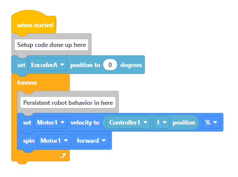

# Structure of a Timed Robot

The timed robot code works similarly to an Arduino, where you have a function that runs one time to initialize or set up your robot, and then you have a function that runs repeatedly (continuously, and forever).

```c
// Sample Arduino Code

// The setup function runs exactly one time, when the program starts
void setup() {
    pinMode(13, OUTPUT);
    // additional setup done here
}

// The loop function runs continuously while the program is running
void loop() {
    digitalWrite(13, HIGH);
    // additional code here to run the program
}
```

You can also view the Timed Robot as a VEX robot, where the setup is done on startup, and the looping code is done in a Forever block.

<figure><figcaption><p>Sample VEX V5 Code</p></figcaption></figure>

### Robot Modes

Robots in FRC have 4 distinct modes that they can be running in:

* **Disabled Mode** - The robot is disabled and code is not allowed to run on it.
* **Test Mode** - Specific code can be put within the robot's Test Mode in order to test certain parts of the robot, to make sure it is properly working before using the code in Teleoperated or Autonomous.
* **Autonomous Mode** - The robot runs purely off of program code, with no input from a driver.
* **Teleoperated Mode** - The robot runs based off of driver input (usually from a gamepad or other controller).

Notice that each mode of the robot has a corresponding setup function (called "init" for "initialize") as well as a corresponding loop function (called "periodic").  When a robot switches modes, it first runs the corresponding `init` method for that mode exactly one time, followed by the `periodic` method for that mode (which runs forever and is called every 20 milliseconds by default).

Typically, any setup code that initializes components of the robot is placed within the `init` method (such as rezeroing encoders, gyroscope, etc.), and any persistent robot behaviors are placed within the `periodic` method (e.g., responding to joysticks, button presses, or autonomous code).

```java
// Example Setup/Init and Loop/Periodic functions for Teleoperated Mode
@Override
public void teleopInit() {
    // Setup code for teleop mode goes here
}

@Override
public void teleopPeriodic() {
    // Looping code for teleop mode goes here
}
```

### Other Modes

The `robotInit()` function is called exactly once when the robot is turned on, and `robotPeriodic()` is called continuously as long as the robot is on.  Typically, `robotPeriodic()` is used to log data about the robot and its mechanisms.

The simulation mode is used when switching to Simulation Mode when using WPILib's built-in robot simulator.
