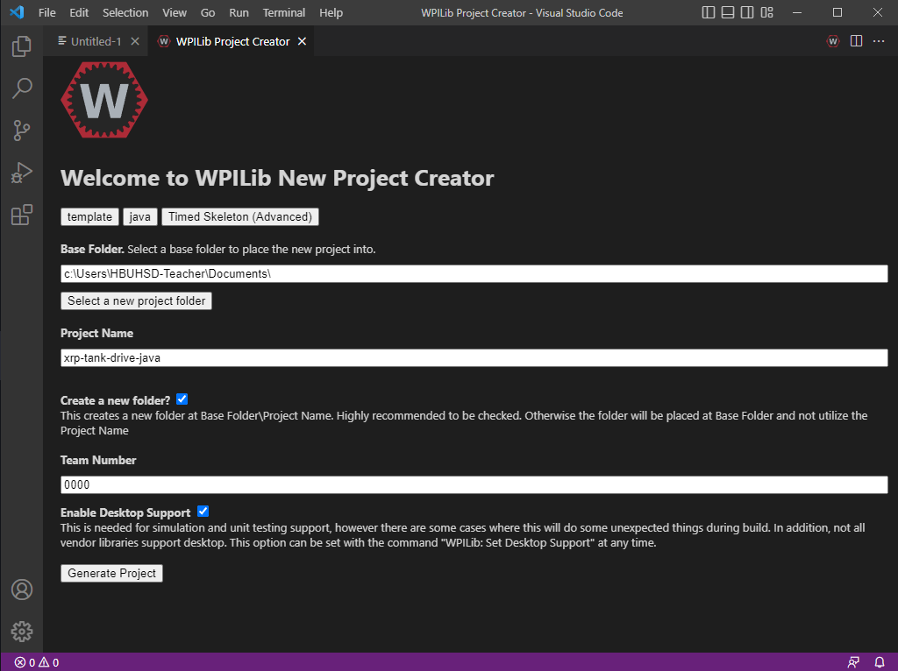

# Simple XRP Program Project Setup

We will create a simple, Tank Drive program for the XRP.  This means that the left joystick on a gamepad will drive the left wheels of the XRP, and similarly for the right joystick and wheels.

### Creating a New WPILib Project

Open WPILib VSCode.  Click on the WPILib "W" symbol in the top right to open up the command palette, or press CTRL+Shift+P (Windows), and select "Create new project".\

<figure><figcaption></figcaption></figure>

The create project dialogue window will open.  For project type, select Template.  Select your preferred language (C++/Java).  For this project, we will be using the Timed Robot template.  You can choose either the Timed Robot or the Timed Skeleton (Advanced).  Choose the folder you wish to save your project in, give your project a name, and put in your team number.  Make sure you check the box to enable Desktop Support.  Click "Generate Project", and select "Yes (Open in current window)".\

<figure><figcaption></figcaption></figure>

### Downloading XRP External Library

We need to download an additional library specific to the XRP into our project so that our program has access to XRP specific things.  The XRP library needs to be downloaded into your WPILib project as an External 3rd Party Library.  Open up the Command Palette again by either pressing Ctrl+Shift+P (Windows) or by clicking the WPILib "W" icon in the top right hand corner.  Select "Manage Vendor Libraries", and then select "Install new library (online)".

<figure><figcaption></figcaption></figure>

When prompted for a URL, go to the [WPILib 3rd Party Libraries](https://docs.wpilib.org/en/stable/docs/software/vscode-overview/3rd-party-libraries.html) page, scroll down to XRP Library, and copy and paste the XRP Vendordep URL.  Press Enter, and select "Yes" when prompted to build your project again.  Your project is now ready to go.

<figure><figcaption></figcaption></figure>
