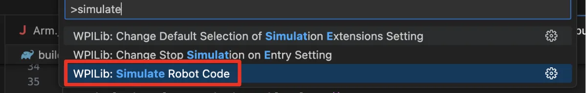
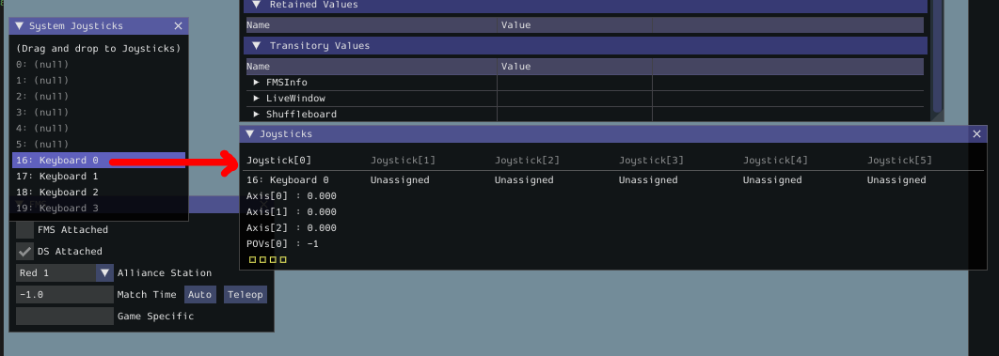

# Simulating the XRP Code

To simulate code on the XRP, first add the following lines of code into the file named `build.gradle` after about line 80 where it says "Simulation configuration (e.g., environment variables)".

```gradle
//Sets the XRP Client Host
wpi.sim.envVar("HALSIMXRP_HOST", "192.168.42.1")
wpi.sim.addXRPClient().defaultEnabled = true
```

Turn on the XRP robot, and connect to the WiFi signal emitted by it.  In WPILib VSCode, open the Command Palette by either clicking the WPILib "W" icon in the top right, or by pressing Ctrl+Shift+P (Windows).  Select "Simulate Robot Code".  Press "OK" when prompted at the top.

<figure><figcaption></figcaption></figure>

Plug in your gamepad/controller (if you have one), and drag it from the Systems Joysticks table to the Joysticks table (if you do not have a gamepad, you can always use the Keyboard 0 joystick, and use the WASD keys as the joystick axes).  Set your joystick to the joystick port that you used in your program code (e.g., port 0).

<figure><figcaption></figcaption></figure>

In the top left of the simulator GUI, switch your operating mode.  Your robot should now run based on the code given (and based on which mode you are operating in).
