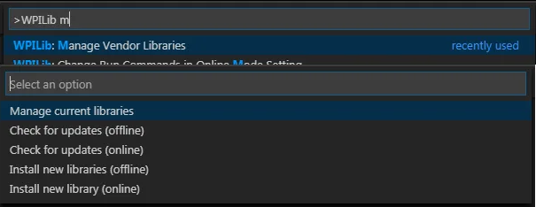
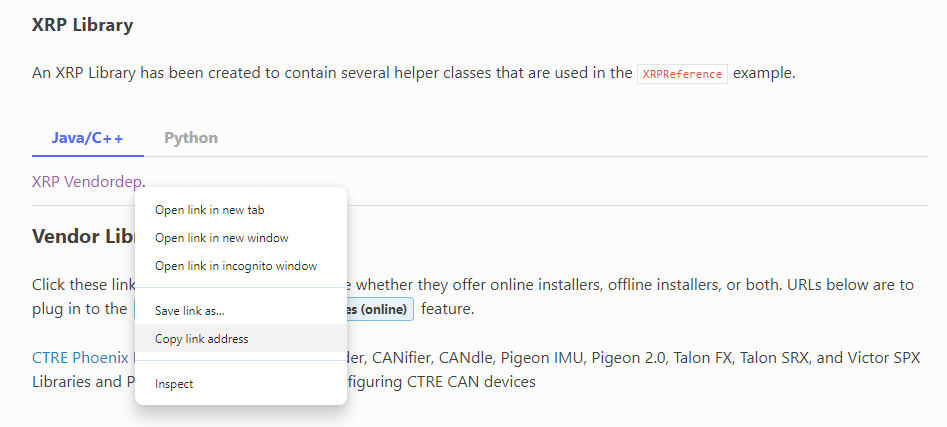

# XRP Project Setup

### Creating a New Project

See [WPILib: Create New Projects](../../frc-programming-theory/wpilib-vscode-how-to/wpilib-create-new-projects.md).

### Downloading XRP Vendor Library

We need to download an additional library specific to the XRP into our project so that our program has access to XRP specific things.  The XRP library needs to be downloaded into your WPILib project as an External 3rd Party Library.  Open up the Command Palette again by either pressing Ctrl+Shift+P (Windows) or by clicking the WPILib "W" icon in the top right hand corner.  Select "Manage Vendor Libraries", and then select "Install new library (online)".

<figure><figcaption></figcaption></figure>

When prompted for a URL, go to the [WPILib 3rd Party Libraries](https://docs.wpilib.org/en/stable/docs/software/vscode-overview/3rd-party-libraries.html) page, scroll down to XRP Library, and copy and paste the XRP Vendordep URL.  Press Enter, and select "Yes" when prompted to build your project again.  Your project is now ready to go.

<figure><figcaption></figcaption></figure>

### Simulating XRP Code

In order to use WPILib's built-in code simulator on the XRP, we need to add the following lines of code to the file named `build.gradle` after about line 80 where it says "Simulation configuration (e.g., environment variables)".

```gradle
//Sets the XRP Client Host
wpi.sim.envVar("HALSIMXRP_HOST", "192.168.42.1")
wpi.sim.addXRPClient().defaultEnabled = true
```
