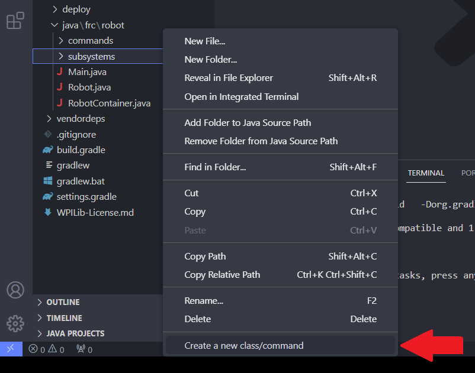

# XRP Timed: Making a Class

## Classes

For a brief introduction or review of classes, see the beginning portions of the [Classes page within the Structs and Classes section](../../../../intro-to-programming-arduino/structs-and-classes/classes.md).

## Why Make Classes - Subsystems

In the previous tutorial about making methods, we bundled together related code into methods to better organize our code and make it easier to maintain.  Our robot code is already getting fairly long, and we have only programmed a drivebase (some wheels and encoders).  You can imagine how much _longer_ our code is going to get once we add additional subsystems on the robot.  A robot subsystem is a collection of robot hardware that typically operates together as a unit to perform a task.  Examples of various subsystems include:

* Drivebases - Includes motors, encoders, gyroscopes, etc. in order to move the robot.
* Vertical Arms - A rod that pivots on one end to swing up and down.  Similar to the way your arm swings around your shoulder joint.
* Turrets - A mechanism that swivels in place.  Think of your head turning back and forth.
* Flywheels - Most anything that spins.  These are usually rollers or compliance wheels that are used to intake or shoot game pieces.
* Vertical Elevator - A mechanism that can act as a lift.

By bundling related objects (such as motors, encoders, etc.) together with their related functions (e.g., drive, lift, shoot) into separate classes, we can further organize our code and make it cleaner and easier to maintain.  Each class should be in its own separate file.

## Creating the Drivebase Class

We will make a class that represents our drivebase.  To better organize our code, we will make a folder for our subsystems (either within `java/frc/robot` or within `src/main/cpp`).  Name the folder "subsystems"

You can make new folders by right clicking where you want the folders to go within the File Explorer on the left sidebar of VSCode, and selecting "New Folder".

<figure><figcaption><p>Creating a new folder within a WPILib Project</p></figcaption></figure>

We are going to represent our drivebase (or drivetrain) as a class in our program.  Right click within your subsystems folder, and select "Create a new class/command".  Select "Empty Class" from the dropdown list that appears, and name it `Drivebase` (case-sensitive).

<figure><figcaption><p>Creating a new class within a WPILib Project</p></figcaption></figure>

## Setting up the Code

We have already done most of the work for the class.  We are going to copy over all the objects and methods that are directly related to the drivebase.  From the `Robot` file, move over all imports, objects, and methods related to the `XRPMotor` , and `Encoder` objects.  Leave behind the teleoperated `init` and `periodic` methods, as well as the `XboxController`.  See the code below for how your `Robot` and `Drivebase` files should look after you refactor them.

While we are moving over the code we are going to add the `private` access specifier to all our objects and variables, and `final` to all of our numeric variables.  The `private` access specifier will make it so that the only way to access our motors and encoders will be through the `public` methods that we create (as in, other programmers will only have access to things that we explicitly give them access to), and making our numbers `final` will ensure that their values will never change while the program is running.




```java
package frc.robot.subsystems;

import edu.wpi.first.wpilibj.xrp.XRPMotor;
import edu.wpi.first.wpilibj.Encoder;

public class Robot extends TimedRobot {
  private XRPMotor m_leftMotor = new XRPMotor(0);
  private XRPMotor m_rightMotor = new XRPMotor(1);
  private Encoder m_leftEncoder = new Encoder(4, 5);
  private Encoder m_rightEncoder = new Encoder(6, 7);
  private final double wheelDiameter = 2.3622;
  private final double trackwidth = 6.1;
  private final double pulsePerRev = 585;
  private final double circumference = Math.PI * wheelDiameter;
  private final double distPerPulse = circumference / pulsePerRev;
  
  public void tankDrive(double leftSpeed, double rightSpeed) {
    m_leftMotor.set(leftSpeed);
    m_rightMotor.set(rightSpeed);
  }
  
  public void resetEncoders() {
    m_leftEncoder.reset();
    m_rightEncoder.reset();
  }
  
  public void setEncoderDistPerPulse(double distPerPulseRatio) {
    m_leftEncoder.setDistancePerPulse(distPerPulseRatio);
    m_rightEncoder.setDistancePerPulse(distPerPulseRatio);
  }
  
  public double averageEncoderDist() {
    double leftEncDist = Math.abs(m_leftEncoder.getDistance());
    double rightEncDist = Math.abs(m_rightEncoder.getDistance());
    return (leftEncDist + rightEncDist) / 2.0;
  }
  
  public void leftTurn(double degrees) {
    resetEncoders();
    double turnDist = (degrees / 360.0) * Math.PI * trackwidth;
    while (averageEncoderDist() < turnDist) {
      tankDrive(-0.5, 0.5);
    }
  }
  
  public void rightTurn(double degrees) {
    resetEncoders();
    double turnDist = (degrees / 360.0) * Math.PI * trackwidth;
    while (averageEncoderDist() < turnDist) {
      tankDrive(0.5, -0.5);
    }
  }
}
```



```java
package frc.robot;

import edu.wpi.first.wpilibj.TimedRobot;
import edu.wpi.first.wpilibj.XboxController;

public class Robot extends TimedRobot {
  XboxController m_controller = new XboxController(0);
  
  @Override
  public void teleopInit() {
  
  }
  
  @Override
  public void teleopPeriodic() {
    double leftStick = -m_controller.getLeftY();
    double rightStick = -m_controller.getRightY();
    tankDrive(leftStick, rightStick);
    
    if (m_controller.getXButton()) {
      driveUntilDist(5);
    }
    
    if (m_controller.getYButton()) {
      leftTurn(90);
    }
    
    if (m_controller.getBButton()) {
      rightTurn(90);
    }
  }
}
```












## Class Constructor

Notice that the initialization code for inverting the motor, resetting the encoders, and setting up their distance per pulse is no longer within the `telopInit` method of the `Robot` file.  There are a few ways around this.

We will initialize, reset, set conversion factors, etc., _within_ the class, so that anything that the `Drivebase` object would need created or initialized is done so within its own class.  This is usually done within the class constructor, and what we will do as well.


You might think that we could take advantage of the fact that the reset encoders, and set distance per pulse methods of the `Drivebase` class are public, and continue to use them within `telopInit`.  We would then also create a public "invert" method that inverts one of the drivebase motors.  However, this is going to lead to a lot of code cluttering within the `teleopInit` method, especially after we start adding more and more subsystems and need to initialize all of them.


Recall that the class constructor is the special method that has no return type, shares the same name as the class, and creates, and returns an object of the class back to us so that we can assign it to variables of that class type.


In the example below, one encoder has been initialized outside the constructor, while the other has been initialized _inside_ of the constructor.  This has been done purely for example to show you the many different ways you _could_ program a constructor, based on your preferences and needs.





```java
package frc.robot.subsystems;

import edu.wpi.first.wpilibj.xrp.XRPMotor;
import edu.wpi.first.wpilibj.Encoder;

public class Robot extends TimedRobot {
  private XRPMotor m_leftMotor = new XRPMotor(0);
  private XRPMotor m_rightMotor = new XRPMotor(1);
  private Encoder m_leftEncoder = new Encoder(4, 5);
  private Encoder m_rightEncoder;
  
  /** other constants not shown **/
  private final double distPerPulse = circumference / pulsePerRev;
  
  /** vv New Code - Constructor vv **/
  public Drivebase() {  // Note: the constructor can also take inputs if needed
    // an example of initializing within constructor
    m_rightEncoder = new Encoder(6, 7);
    
    // Other subsystem specific initializations
    m_rightMotor.setInverted(true);
    resetEncoders();  // method from this class
    setEncoderDistPerPulse(distPerPulse);  // method and constant from this class
  }
  /** ^^ New Code - Constructor ^^ **/
  
  public void resetEncoders() {
    m_leftEncoder.reset();
    m_rightEncoder.reset();
  }
  
  public void setEncoderDistPerPulse(double distPerPulseRatio) {
    m_leftEncoder.setDistancePerPulse(distPerPulseRatio);
    m_rightEncoder.setDistancePerPulse(distPerPulseRatio);
  }
  /** other methods not shown **/
}
```












## Updating the Robot File

Now that you have set up the `Drivebase` class, it is now time to update our `Robot` file to use the `Drivebase` class that we have created.  We begin by importing our custom-made class into the file.




```java
import frc.robot.subsystems.Drivebase;
```








Instead of instantiating objects for each of our motors and encoders, we can instantiate a single `Drivebase` object (which contains all of the motors and encoders within it).  After we have done so, and since we kept the method names for the drivebase functionality the same, we simply need to call the methods from our `Drivebase` object instead of as standalone methods within our teleoperated code.




```java
package frc.robot;

import edu.wpi.first.wpilibj.TimedRobot;
import edu.wpi.first.wpilibj.XboxController;

import frc.robot.subsystems.Drivebase;  // new import for our Drivebase

public class Robot extends TimedRobot {
  XboxController m_controller = new XboxController(0);
  
  // using our constructor to create a Drivebase object
  Drivebase m_drivebase = new Drivebase();
  
  @Override
  public void teleopInit() {
    // there's actually nothing to do here
  }
  
  @Override
  public void teleopPeriodic() {
    double leftStick = -m_controller.getLeftY();
    double rightStick = -m_controller.getRightY();
    
    // Note the use of the dot operator to now access the drivebase methods
    // from our drivebase object
    m_drivebase.tankDrive(leftStick, rightStick);
    
    if (m_controller.getXButton()) {
      m_drivebase.driveUntilDist(5);
    }
    
    if (m_controller.getYButton()) {
      m_drivebase.leftTurn(90);
    }
    
    if (m_controller.getBButton()) {
      m_drivebase.rightTurn(90);
    }
  }
}
```











