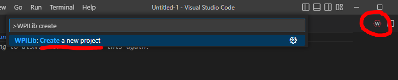
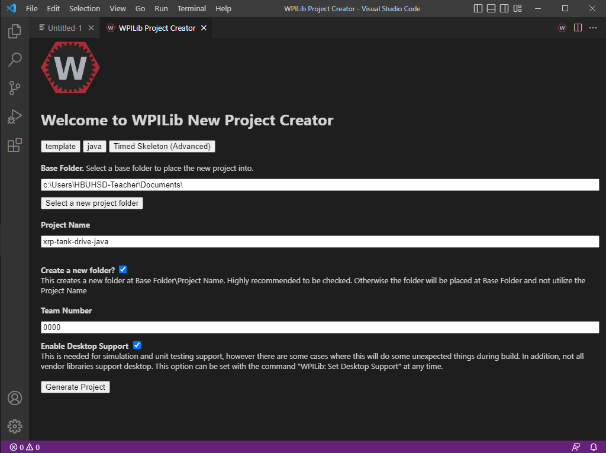

# WPILib: Create New Projects

### Creating a New WPILib Project

Open WPILib VSCode.  Click on the WPILib "W" symbol in the top right to open up the command palette, or press CTRL+Shift+P (Windows), and select "Create new project". 

<figure><figcaption>
Command Palette: Create a new project
</figcaption></figure>

The create project dialogue window will open.  For project type, select Template.  Select your preferred language (C++/Java).  Depending on how you want to program your robot, you will most often choose either Timed Skeleton (Advanced), or Command Robot Skeleton (Advanced).  Choose the folder you wish to save your project in, give your project a name, and put in your team number.  Make sure you check the box to enable Desktop Support.  Click "Generate Project", and select "Yes (Open in current window)".

<figure><figcaption>
Creating a new project
</figcaption></figure>
