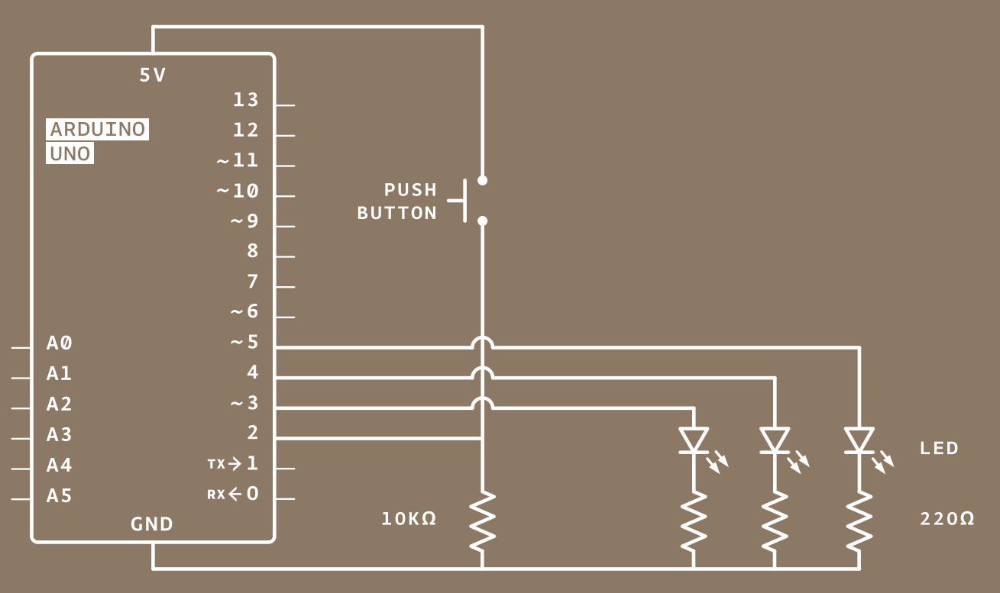

# Arduino If-Statements

## If-Statements

In programming, an if-statement is a block of code that allows your program to "make a decision" based on whether or not a given condition is true or false.  The image below represents this concept.  If the answer to, "Is it raining" is "yes", then you will bring an umbrella; otherwise, you will leave the umbrella at home.

<figure><figcaption></figcaption></figure>



| Code                                                                                                           | Explanation                                                                                                                                                                                                                                                                                                                 |
| -------------------------------------------------------------------------------------------------------------- | --------------------------------------------------------------------------------------------------------------------------------------------------------------------------------------------------------------------------------------------------------------------------------------------------------------------------- |
| <div><figure><figcaption></figcaption></figure></div>     | When the condition in the diamond shape is true, then the code in the block will run.  When it is false, then the code is skipped.                                                                                                                                                                                          |
| <div><figure><figcaption></figcaption></figure></div> | <p>When the condition in the diamond shape is true, then the code in the first section (if section) of the block will run, and the second section (else block) is skipped.<br><br>When the condition in the diamond shape is false, then the code in the if section of the block is skipped, and the else block is run.</p> |



| Code                                                                                                           | Explanation                                                                                                                                                                                                                                                                                                             |
| -------------------------------------------------------------------------------------------------------------- | ----------------------------------------------------------------------------------------------------------------------------------------------------------------------------------------------------------------------------------------------------------------------------------------------------------------------- |
| <div><figure><figcaption></figcaption></figure></div>     | When the condition in the parentheses is true, then the code in the block will run.  When it is false, then the code is skipped.                                                                                                                                                                                        |
| <div><figure><figcaption></figcaption></figure></div> | <p>When the condition in the parentheses is true, then the code in the first section (if section) of the block will run, and the second section (else block) is skipped.<br><br>When the condition in the parentheses is false, then the code in the if section of the block is skipped, and the else block is run.</p> |



<table><thead><tr><th>Code</th><th>Explanation</th></tr></thead><tbody><tr><td><pre class="language-cpp"><code class="lang-cpp">if (condition)
{
    // code
}
</code></pre></td><td>When the condition in the diamond shape is true, then the code in the block will run.  When it is false, then the code is skipped.</td></tr><tr><td><pre class="language-cpp"><code class="lang-cpp">if (condition)
{
    // true section
}
else
{
    // false section
}
</code></pre></td><td>When the condition in the diamond shape is true, then the code in the first section (if section) of the block will run, and the second section (else block) is skipped.<br><br>When the condition in the diamond shape is false, then the code in the if section of the block is skipped, and the else block is run.</td></tr></tbody></table>



## Example Basic

Suppose we had the following circuit.  We have a button wired to pin 8 and an LED wired to pin 7.  Our goal is to make the circuit have the following behavior: IF **the button is being pressed**, then _turn on the LED_; otherwise, _turn off the LED_.

In the current setup, the button will send a HIGH signal to pin 8 when it is being pressed, and a LOW signal to pin 8 when it is not being pressed.  In Arduino, a HIGH signal is also the same as TRUE, and a LOW signal is the same as FALSE.


Feel free to build and program this circuit on your own, so that you can get some practice.


<figure><figcaption></figcaption></figure>



<div align="left"><figure><figcaption></figcaption></figure></div>



Note that when digital pin 8 receives a HIGH signal, it will be read as true, and so the first block of code runs, which turns on the LED on pin 7.

<div align="left"><figure><figcaption></figcaption></figure></div>



Use the `digitalRead` function from Arduino to get inputs from the pins.  In this case, we are reading the signal the button is sending to pin 8.

<pre class="language-cpp"><code class="lang-cpp">void setup()
{
    pinMode(8, INPUT);
    pinMode(7, OUTPUT);
}

void loop()
{
<strong>    // TinkerCAD equivalent - one option
</strong>    if (digitalRead(8) == HIGH)    // if the button reads a HIGH signal
    {
        digitalWrite(7, HIGH);     // then, turn on the LED
    }
    else
    {
        digitalWrite(7, LOW);      // otherwise, turn it off
    }
    
    // mBlock equivalent - another option
    if (digitalRead(8))            // if the button reads HIGH (which is TRUE)
    {
        digitalWrite(7, HIGH);     // then, turn on the LED
    }
    else
    {
        digitalWrite(7, LOW);      // otherwise, turn it off
    }
}
</code></pre>



## Example with Variables

Just for fun, we can also store the button state in a variable, and use the variable whenever we need to reference the state of the button.  This is shown purely for example.



<div align="left"><figure><figcaption></figcaption></figure></div>



Note that since mBlock does not have HIGH / LOW blocks, that you need to check if the button state is 1 (for HIGH) or 0 (for LOW) instead.

<div align="left"><figure><figcaption></figcaption></figure></div>



Use the `digitalRead` function from Arduino to get inputs from the pins.  In this case, we are reading the signal the button is sending to pin 8.

```cpp
bool isButtonPressed;    // a boolean type can only be true or false

void setup()
{
    pinMode(8, INPUT);
    pinMode(7, OUTPUT);
}

void loop()
{
    isButtonPressed = digitalRead(8);
    
    // Option 1: explicitly checking if it is true
    if (isButtonPressed == true)  // can also check if it is == HIGH as well
    {
        digitalWrite(7, HIGH);
    }
    else
    {
        digitalWrite(7, LOW);
    }
    
    // Option 2: preferred way, once you get comfortable with it
    if (isButtonPressed)
    {
        digitalWrite(7, HIGH);
    }
    else
    {
        digitalWrite(7, LOW);
    }
}
```



## Traffic Light Activity

Create a "traffic signal" out of the Arduino, LEDs, and pushbutton.  Program it so that when you push the button, the lights will change and cycle through the lights (like a real traffic signal).  Examples are shown below.


The examples are given as a guide in case you are totally lost, however, feel free to customize the activity and project in any way you like.  You can add more lights, more buttons, or program it to do something different than shown in the sample video.




Click to zoom in on the images.

| Sample Circuit                                                                                                                   | Circuit Diagram                                                                                                                          |
| -------------------------------------------------------------------------------------------------------------------------------- | ---------------------------------------------------------------------------------------------------------------------------------------- |
| <div><figure><figcaption></figcaption></figure></div> | <div><figure><figcaption></figcaption></figure></div> |

## Additional Learning

### Nested If-Statements

In this context, the word "nesting" refers to the concept of having something inside of something else.  A common example of this is Russian nesting dolls (when each doll has another doll within it).

<div align="left"><figure><figcaption></figcaption></figure></div>

If-statements are nested when you put an if-statement within another if-statement.  The inner if-statement (or nested statement) can be put within the if-block of code or in the else-block of code.  It depends on what kind of code logic you want.  Some examples are shown below, with explanations beneath the table.

| Code                                                                                                                         | Flowchart                                                                                                                        |
| ---------------------------------------------------------------------------------------------------------------------------- | -------------------------------------------------------------------------------------------------------------------------------- |
| <div><figure><figcaption></figcaption></figure></div>         | <div><figure><figcaption></figcaption></figure></div>         |
| <div><figure><figcaption></figcaption></figure></div> | <div><figure><figcaption></figcaption></figure></div> |

#### Example 1

In the first example, the second if-statement is nested within the "if" section of the first statement.  In the flowchart, this can be seen as nesting the diamonds on the "yes" side of the previous one.  As a set of instructions, this can be viewed as

1. First, check if button 8 is pressed.  If button 8 is pressed, then go to step 2; otherwise, turn off the LED and go to step 3.
2. If button 8 is pressed, then check if button 9 is pressed.  If button 9 is pressed, then turn on the LED and end the program; otherwise, turn off the LED, and go to step 3.
3. End the program.

With this kind of nesting, the LED only turns on when BOTH button 8 AND button 9 are pressed together, and turns off otherwise.

#### Example 2

In the second example, the second if-statement is nested within the "else" section of the first statement.  In the flowchart, this can be seen as nesting the diamonds on the "no" side of the previous one.  As a set of instructions, this can be viewed as

1. First, check if button 8 is pressed.  If it is, then turn on the LED, and go to step 3.  Otherwise, go to step 2.
2. If button 8 is not pressed, then check if button 9 is pressed.  If it is, then turn on the LED.  Go to step 3.
3. End the program.

With this kind of nesting, the LED turns on when EITHER button 8 OR button 9 are pressed (or when they are both pressed together), and is off only when both buttons are not being pressed.

### if-else-if Statements

Here is another way to write nested if-statements when nesting within the else portion of the statement.

<table><thead><tr><th>Nested</th><th>Alternate Syntax</th></tr></thead><tbody><tr><td><pre class="language-cpp"><code class="lang-cpp">if (condition1)
{
    // condition 1 is true
}
else
{
    if (condition2)
    {
        // condition1 is false
        // condition2 is true
    }
    else
    {
        // both conditions false
    }
}
</code></pre></td><td><pre class="language-cpp"><code class="lang-cpp">if (condition1)
{
    // condition1 is true
}
else if (condition2)
{
    // condition1 is false
    // condition2 is true
}
else
{
    // both conditions false
}
</code></pre></td></tr><tr><td></td><td></td></tr><tr><td></td><td></td></tr></tbody></table>

### Additional Operators

Earlier, we used the equality operator (the green equals block for blocks, and `==` for C++).  There are other operators you can use when working with conditions to create true / false values.  You can study them (in C++) here.

* [C++ Comparison Operators](https://www.w3schools.com/cpp/cpp_operators_comparison.asp)
* [C++ Logical Operators](https://www.w3schools.com/cpp/cpp_operators_logical.asp)

In block programming, they are the green blocks, and are the mathematical operators (+, -, \*, /), the comparison operators (>, <, =, ≥, ≤, ≠), and the logical operators (and, or, not).
