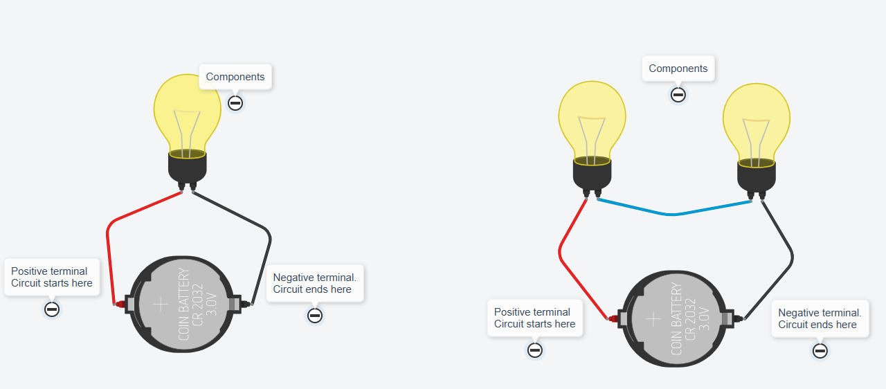
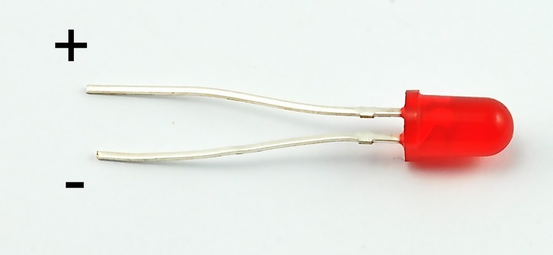
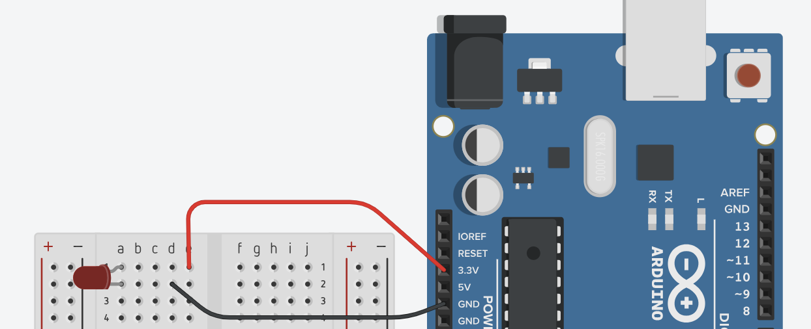

# Arduino Creating Circuits

## Basic Theory

A circuit is a group of electronic components that are connected together.  A circuit always starts at the positive side of its power source (e.g., the plus side of a battery), connects to any number of devices (lights, motors, sensors), and ends at the negative side of its power source (called "ground"; e.g., the minus side of a battery).


You should NEVER connect a power source's positive terminal directly to its negative terminal.  On an Arduino, this would be connecting 5V or 3.3V directly into the GND pin.  This is called a **short circuit**, and can result in the following

* Hardware (such as Arduino) will not turn on when plugged in
* Hardware will heat up (and become VERY hot)
* Hardware begins to melt
* Hardware explodes

If any of the above occur, or you suspect you have created a short circuit, then **disconnect and turn off your electronics right away**.  Double check your circuit (with a partner or teacher) before plugging in your hardware again.


<figure><figcaption></figcaption></figure>

## Connecting our Components

As long as electrical components are connected to a power source's positive and negative terminals, electricity will run through it, and it will have power (it will turn on).  Usually, we use wires to connect our components.  These can be alligator clips, or "regular" jumper cables.  To help us build circuits, we will be using breadboards.  See the video below to learn how breadboards work.



## Activity - Learn the Breadboard

Our first activity will be to light up some LEDs using the Arduino as a battery (power source), and the breadboard to create connections.  An LED is a **L**ight **E**mitting **D**iode, and gives off light when current (electricity) runs through it in the correct direction.  In an LED, the longer leg should be connected to a power source (positive side), and the shorter leg should be connected to electrical ground (labeled GND; the negative side).

<figure><figcaption></figcaption></figure>


You can build and connect your circuit however you want.  As long as the longer leg of the LED is connected to a power source and the shorter leg is connected to electrical ground, then the LED will light up.  The instructions below are very detailed so that if you are brand new to circuit building, then you can follow the instructions exactly, and your circuit should work.  Note that any examples in the instructions are not **THE** way to build the circuit, it is simply **ONE** way to build it.


**Create the following circuit (in real life or in TinkerCAD):**

1. Double check to make sure that your Arduino is not plugged into a computer or battery.  You do not want to create circuits while live current is running through your components.
2. Connect the LED to the breadboard.  Put the longer leg in 1A and the shorter leg in 2A.
3. Using a jumper cable, connect the longer leg of the LED to the 3.3V voltage source on the Arduino.  In the diagram, this is the red wire.
   1. Do this by connecting one end of the jumper cable to 1E and the other end to 3.3V on the Arduino.
   2. Note that since things on the same row number on the breadboard are connected with a strip of metal running underneath, the longer leg of the LED in 1A is connected to the cable at 1E (which is then connected to the 3.3V power supply on the Arduino).
4. Using a jumper cable, connect the shorter leg of the LED to electrical ground on the Arduino.  In the diagram, this is the black wire.
   1. Do this by connecting one end of the jumper cable to 2D and the other end to GND on the Arduino.  The Arduino has multiple pins labeled GND; you can plug into any one of them since they are all connected to the same electrical ground.
5. Once you are done, you should be able to plug your Arduino into your computer to turn it on, and your LED should also turn on.

<figure><figcaption></figcaption></figure>


Only use the 3.3V power supply to power your LEDs.  Using the 5V supply (or batteries with higher voltage) will blow out your LEDs, causing permanent damage.  If you wish to use higher voltage in your circuit, you MUST use resistors to lower the current.


## Wire Colors

Note that the color of wires used _in principle_ does not matter, since at the end of the day, a wire is just a piece of conductive material (metal).  You can technically use any color wire anywhere, and it would not matter.

However, to make things easier for everyone, most electricians utilize the following conventions:

* Red wires - Used to indicate "hot" wires, or wires that are connected to some sort of power supply.  These are "positive" wires.
* Black wires - Used to indicate "ground" wires, or wires that are connected to electrical ground (or the negative terminal of a power supply).  These are "negative" wires.

NEVER connect the red and black wires to each other.  This is called a short circuit, and is dangerous and can cause injuries.

## Extension

Using the same 3.3V power source from a single Arduino, try to light up as many LEDs as possible in as many different configurations as possible on the breadboard.  This will help you get more comfortable working with and connecting electrical components.  You can copy the circuit provided, or make a copy of the circuit on TinkerCAD.  Feel free to experiment on your own and add additional LEDs not included in the sample circuit.




When creating circuits, always remember to unplug and/or turn off your power supply (in our case, it means unplugging the Arduino; later on, it means turning off the robot).  Making connections with "live wires" (as in, when electricity is running through them) is a safety hazard, and can damage both you and the electrical components.

