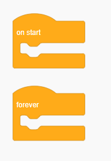
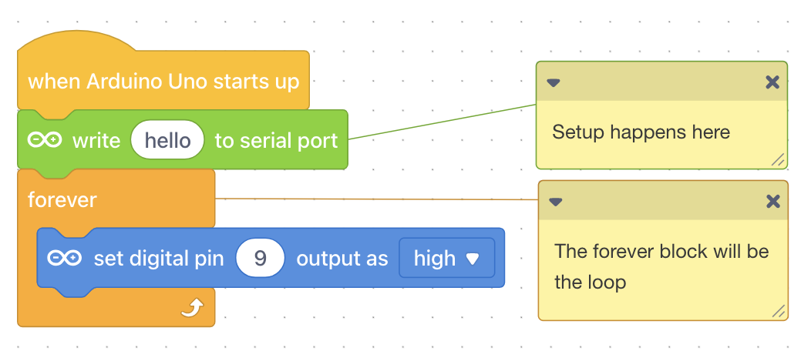
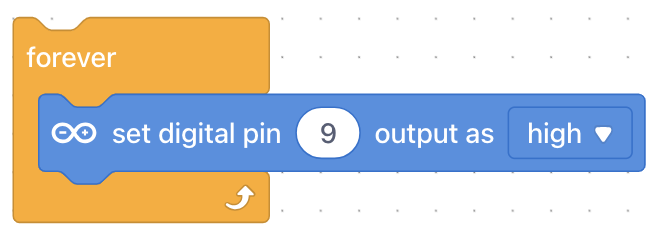
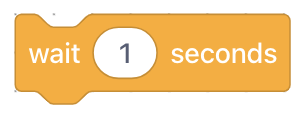
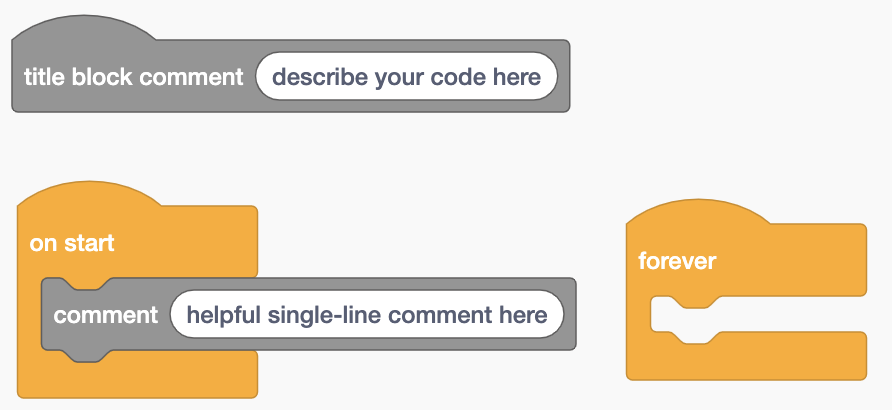

# Arduino Programming

## Arduino Program Structure

We will learn how to program by using Arduino and other electrical components.  In an Arduino program, there are three key places our code goes:

* **At the top of the program -** We import other libraries and create global variables here.
* **Inside of setup() -** In Arduino, `setup` is a special function.  Any code written inside of `setup` will run exactly one time at the beginning of your program.  Usually, we put code that sets up our hardware here (e.g., setting up pins/ports, setting up initial configurations, etc.).
* **Inside of loop() -** In Arduino, `loop` is a special function that repeats forever.  Any code written inside of  `loop`  will run forever.



The blocks can be found in the "Control" tab.

<div align="left"><figure><figcaption><p>Basic Structure of Arduino Code in Blocks</p></figcaption></figure></div>



In mBlock, there is no block for "setup" and "loop".  The "loop" portion is represented by the forever block (which loops forever), and any setup code will occur above the forever block.

<figure><figcaption></figcaption></figure>



```arduino
// library imports and variables go here

void setup()
{
  // initial setup code goes here
}

void loop()
{
  // main code goes here
}
```



## Arduino Programming Basics

To get started with programming our Arduino, we will start with three, built-in, Arduino functions.  These functions allow us to write code that interacts with the Arduino.

**pinMode(pin\_number, mode)**

Sets up the Arduino pin with the appropriate mode (either `INPUT` or `OUTPUT` ).  We typically put this within `setup` .  Pins set as output can send, or give off signals (i.e., voltage), and pins set as input can receive signals (e.g., from buttons).

**digitalWrite(pin\_number, signal)**

Tells the pin at `pin_number`  to give an output signal.  The signal can either be `HIGH` (on) or `LOW` (off).  The pin must have a pin mode of `OUTPUT` .

**delay(time\_ms)**

The `delay` function will pause the Arduino.  No additional code will run for the duration of the wait time and the code will get "stuck" at that line of code.  The wait time is given in milliseconds.


Using a `delay` will completely pause the Arduino code at that particular line of code.  No inputs will be read until _after_ the delay has passed.  This means that even if you are pressing a button, the button presses will not be registered by the code until the code finishes the delay and loops back to when it checks your button press.




**pinMode(pin\_number, mode)**


Note that when using TinkerCAD blocks, the block environment will use the `pinMode` function for you; there is no block for it, and it cannot be seen when programming in blocks


**digitalWrite(pin\_number, signal)**

<div align="left"><figure><figcaption><p>Block Version of Digital Write</p></figcaption></figure></div>

**delay(time\_ms)**

<div align="left"><figure><figcaption><p>Block Version of Delay</p></figcaption></figure></div>



**pinMode(pin\_number, mode)**


Note that when using mBlock blocks, the block environment will use the `pinMode` function for you; there is no block for it, and it cannot be seen when programming in blocks


**digitalWrite(pin\_number, signal)**

<div align="left"><figure><figcaption></figcaption></figure></div>

**delay(time\_ms)**

<div align="left"><figure><figcaption></figcaption></figure></div>



**pinMode(pin\_number, mode)**

```arduino
void setup()
{
    pinMode(13, OUTPUT);    // sets up pin 13 as an output pin
}
```

**digitalWrite(pin\_number, signal)**

```arduino
void setup()
{
    pinMode(13, OUTPUT);
}

void loop()
{
    digitalWrite(13, HIGH);    // Sends a signal of HIGH through pin 13
}
```

**delay(time\_ms)**

```arduino
void loop()
{
    delay(1000);    // Wait for 1000 ms (or 1 second)
}
```



## Program Comments

Comments are any pieces of code that are not read by the program.  They are meant to provide messages or explanations to other programmers when they read your code.

<div align="left"><figure><figcaption><p>Comments in TinkerCAD</p></figcaption></figure></div>

<figure><figcaption><p>Comments in mBlock</p></figcaption></figure>

```cpp
// Comments are the same in both C++ and in Java

/* multi-line comment
anything in here is not
read by the program */

void setup() {
    pinMode(13, OUTPUT); // single-line comment
    // another single-line comment
}
```
