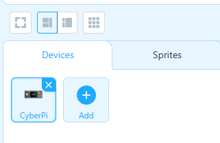
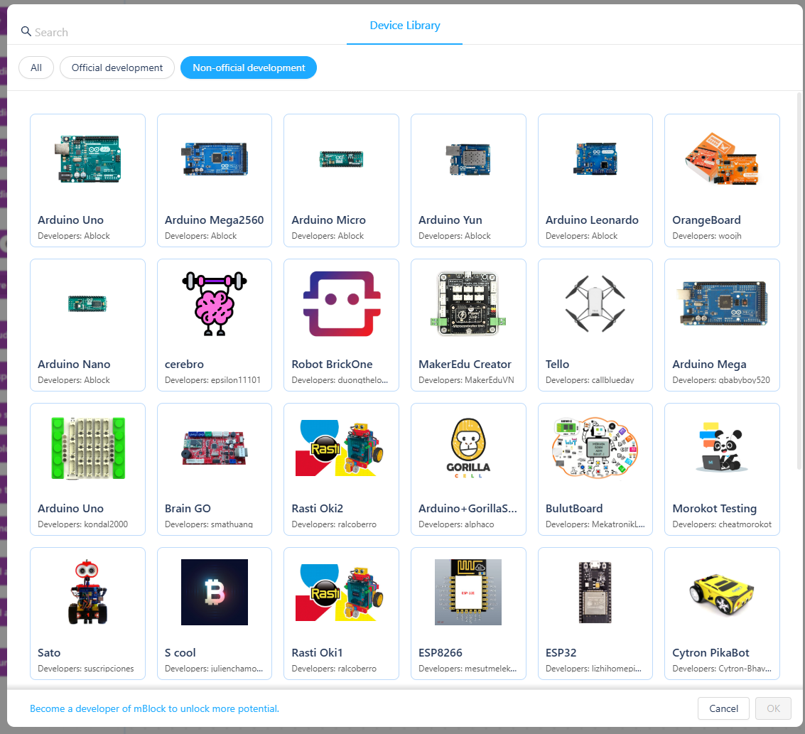
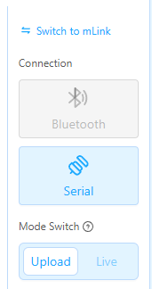
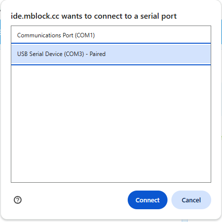
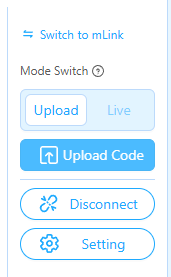

# Programming in mBlock

## Video Tutorial

Captions are included in the video.



## Connecting your Arduino

Navigate to the mBlock IDE at [https://ide.mblock.cc/](https://ide.mblock.cc/).  To program the Arduino using mBlock, you must connect the device to the IDE.  Do this after you have finished wiring up your circuit.

1. Plug your Arduino into your computer using a USB-A to USB-B cable.
2. On the left-hand-side, underneath the Stage in the "Devices" tab, click on "Add".\
   
3.  Select the "Non-official development" tab, and select your Arduino device (for the purposes of this documentation, we will use the Arduino Uno).<br>

    <div align="left"><figure><figcaption></figcaption></figure></div>
4. On the left-hand-side, click on Serial, and select the Serial port your Arduino device is connected to (if it is the only thing connected to your computer, then you should only have one option).\
   
5. When you have finished programming, select "Upload Code"\
   

## Programming in C++

If you would like to program in C++ using mBlock, then select the "Arduinoc" tab in the top-right-hand corner of the of the programming environment.

The only difference between programming here versus on the official Arduino IDE, is that you must explicitly include the `Arduino.h` header file in your mBlock program.  Have the following line of code at the top of all your mBlock programs.

```cpp
#include <Arduino.h>
```

Connect your Arduino, and upload code as in the instructions above.
