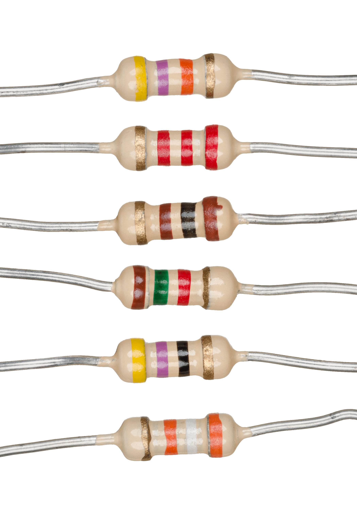
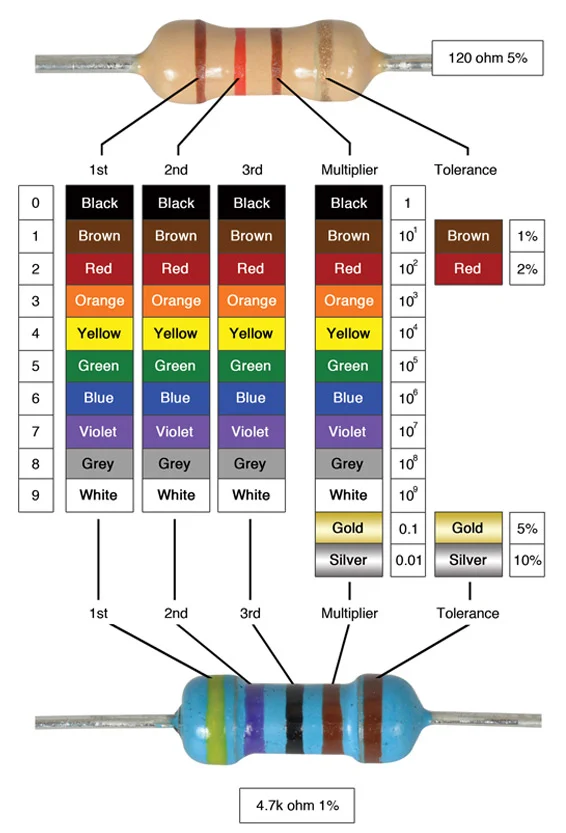

# Resistors (Optional Content)

## Resistors


Deep knowledge about resistors, what they do, and why we use them is not necessary for any of the activities presented.  If you do not care to know more about resistors, jump to the next section [First Program: LED Blink](../first-program-led-blink.md),  proceed to build the circuit, and program it.


In the [Creating Circuits](arduino-creating-circuits.md) activity, we used the 3.3V power supply to provide power to our LEDs.  The power supply pin is useful for turning things on, but not very useful for doing anything fancier than that.

* In order to have our circuits do more interesting things, we want to be able to send instructions to the Arduino via a computer program.
* Arduino programs can get inputs and send outputs using the numbered pins on the Arduino (for example, pins 1 through 13 on the right hand side of the Arduino).
* The numbered pins will output 5V; this is too high and will cause too much electricity to flow into the LEDs, damaging them.  We need to somehow lower the current in the circuit.
* To lower the current flow (and protect the LEDs) we need to add resistors to our circuits.

<figure><figcaption>
Various resistors
</figcaption></figure>

Resistors are an electrical component that reduces the amount of current running through a circuit.  They have a **resistance value** - called resistance - and its unit of measure is **ohms**.  The symbol for ohms is the capital Greek letter omega (Ω).  The higher the resistance value, the lower the resulting current is.

### Measuring Resistance

To measure the resistance of a resistor, you look at the colored stripes (called **color bands**) on the resistor (or you can manually measure with a multimeter).

* Each color band corresponds to a digit in the resistance value
* The second to last color band is the multiplier.  You multiply the resistance value of the previous bands by the multiplier.
* The last color band is the tolerance.  This is how close the actual resistance value of the resistor is to its theoretical value (as given by the color bands).


Sometimes, it is difficult to tell which color band is the tolerance band.  Tolerance bands are always the last color band, and will be the right-most band when reading resistors from left-to-right.  Silver or gold color bands are always the tolerance.  For resistors with five color bands, the tolerance band can also be brown or red.


In the chart below, the brown resistor (top) is a 4-band resistor.  The bands are

* brown - 1st digit of resistance value is 1.
* red - 2nd digit of resistance value is 2.
* brown - Multiplier band.  A brown multiplier is 10.
* gold - Tolerance band.  The tolerance is plus / minus 5%.

Putting this all together, the resistance of the brown resistor is theoretically 12 x 10 = 120 ohms, with a tolerance of plus / minus 5% (meaning the true resistance could be anywhere between 114 and 126 ohms).

<figure><figcaption></figcaption></figure>

For the blue resistor (bottom), it is a 5-band resistor.

* yellow - 1st digit of resistance is 4
  * According to the chart, yellow bands cannot be tolerance bands.  Therefore, the yellow band must be the first band, and the last brown band is the tolerance band.
* violet - 2nd digit of resistance is 7
* black - 3rd digit of resistance is 0 (using the left column of the chart)
* brown - Multiplier band.  A brown multiplier is 10.
* brown - Tolerance band.  A brown tolerance is 1%.

Putting this all together, the resistance is 470 x 10 = 4,700 ohms with a 1% tolerance.
