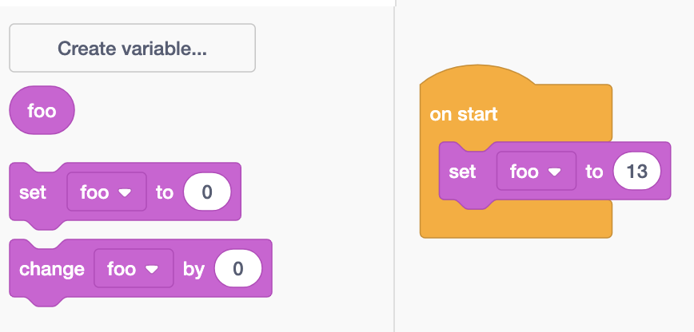

# Arduino Variables

## What are Variables

In programming, a variable is data that has a name.  We use variables to store data, and to also give it a name so that it is easier to manage the data.

## Creating Variables



In the "Variables" section, you click on "Create a Variable".  Note that only numerical type variables can be created.

Use the "set variable to" block in order to assign values to the variable.

<figure><figcaption></figcaption></figure>



In C++, when you create a variable, you need to state what data type the variable is.  The most common data types include

* int - whole numbers
* float - decimal numbers
* double - decimal numbers
* bool - TRUE / FALSE

```arduino
// Creating variables named x, y, z
// of various data types
int x;
double y;
bool z;
```

You can assign the variable a value either when you create it or anytime afterwards.

```arduino
int x = 5;  // assigning a value on creation
double y = 3.14;
bool z;

z = true;  // note that you do not put the data type when using variables
```


