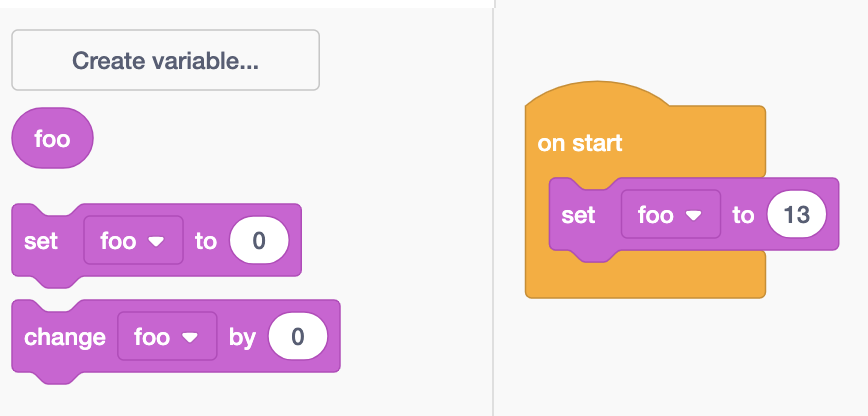
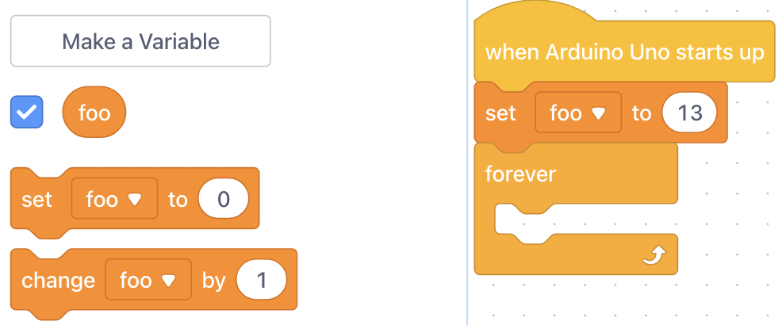
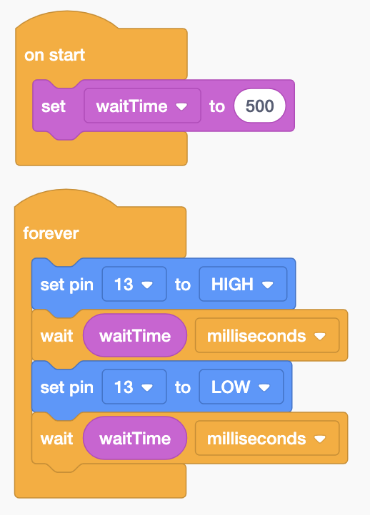

# Arduino Variables

## What are Variables

In programming, a variable is data that has a name.  We use variables to store data, and to also give it a name so that it is easier to manage the data.

## Creating Variables



In the "Variables" section, you click on "Create a Variable".  Note that only numerical type variables can be created.

Use the "set variable to" block in order to assign values to the variable.

<div align="left"><figure><figcaption></figcaption></figure></div>



In the "Variables" section, you click on "Create a Variable".  Note that only numerical type variables can be created.

Use the "set variable to" block in order to assign values to the variable.

<div align="left"><figure><figcaption></figcaption></figure></div>



In C++, when you create a variable, you need to state what data type the variable is.  The most common data types include

* int - whole numbers
* float - decimal numbers
* double - decimal numbers
* bool - TRUE / FALSE

```cpp
// Creating variables named x, y, z
// of various data types
int x;
double y;
bool z;
```

You can assign the variable a value either when you create it or anytime afterwards.

```cpp
int x = 5;  // assigning a value on creation
double y = 3.14;
bool z;

z = true;  // note that you do not put the data type when using variables
```



### Naming Variables

Some rules and conventions for variable names.

* Variable names MUST be unique
* Variable names MUST start with either a letter or an underscore (\_)
* Variable names SHOULD be descriptive; not too short (or single letters), and not too long
  * Examples for a variable that represents some duration of time
    * `waitTime` is preferred
    * `t` is not good
    * `theAmountOfTimeWeWaitBeforeNextAction` is not good either
* Variable names SHOULD use either camelCase or snake\_case
  * camelCase is when the first letter of every word in the variable is uppercase (except for the first word)
    * Examples: `waitTime` , `maxHeight` , `isButtonPressed`
  * snake\_case is when words are separated by underscores
    * Examples: `wait_time` , `max_height` , `is_button_pressed`

## Activity - Using Variables

Use the same (or similar) circuit that you created for the LED Blink program.

1. Create a variable of type `int` and name it `waitTime`.
2. Within `setup` (or On Start for TinkerCAD, or before the forever loop for mBlock), set the value of `waitTime`  to 1000.
   1. Be careful with units here.  Time in TinkerCAD and Arduino C++ are measured in milliseconds (ms), so 1000 ms is equal to 1 second.  In mBlock, you want to set your `waitTime` variable to a value of 1, since mBlock measures time in seconds.
3. Within the wait block (delay), replace the number with `waitTime`.
4. Send the code to the Arduino and run your program.
5. In the code, change the value of `waitTime` to 500 (milliseconds; 0.5 for mBlock).
6. Send the code to the Arduino and run your program again.  The LED should be blinking more frequently now.



<div align="left"><figure><figcaption></figcaption></figure></div>



<div align="left"><figure><figcaption></figcaption></figure></div>



```cpp
#include <Arduino.h> // only needed if programming in mBlock

int waitTime = 0.5;

void setup()
{
    pinMode(13, OUTPUT);
}

void loop()
{
    digitalWrite(13, HIGH);
    delay(waitTime);
    digitalWrite(13, LOW);
    delay(waitTime);
}
```




In the example above, using a variable allows us to change all the wait times at the same time, by changing the single value stored in the `waitTime` variable.  If we did not use a variable, then if we wanted to change the wait time (delay) between blinks, we would need to update the values manually in every single wait block (or every delay line).

