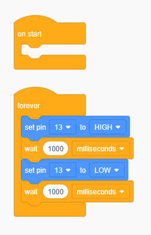

# First Program: LED Blink

## Video Tutorial

Captions included in the video.  This video showcases completing the activity using ALL the options presented in this documentation (TinkerCAD, mBlock, Arduino IDE).  Use the video chapters to watch just the portion that is relevant to how you are using Arduino.



## The Circuit

In our first program, we will simply turn LEDs on and off.  Build the following circuit below.  You can build using either physical components, or virtually through TinkerCAD.

1. Grab the necessary components.  You will need
   * Jumper wires (at least 2)
   * x1 Resistor (at least 220 ohms)
   * x1 LED
   * x1 breadboard
2. We will connect our LED so that the longer leg is connected to a power supply, and the shorter leg is connected to electrical ground.
   1. The "flow of electricity" will be from Arduino Pin 13 (our power source) → resistor → LED (long leg) → LED (short leg) → electrical ground (GND).
3. Power off and unplug your Arduino board.
4. Make a connection between Arduino Pin 13 and with 1A on the breadboard.
5. Connect one leg of your resistor to 1E on the breadboard.
6. Connect the other leg of your resistor to 1G on the breadboard.
   1. Note that pins A-E on a breadboard are not connected to pins F-J on the breadboard.
7. Connect your LED to the breadboard.  In the example circuit, the longer leg is in 1J and the shorter leg is in the power rail labeled minus (-).
8. Using a jumper cable, connect one end to the same minus power rail the LED is connected to, and connect the other leg to an Arduino GND pin.

<figure><figcaption></figcaption></figure>

## LED Blink Program

Our program will cause our LED to turn on and off (blink) at 1 second intervals.  The code logic is like this:

* Turn the LED on
* Wait for 1 second (the LED stays on for the duration of the wait time)
* Turn the LED off
* Wait 1 second (the LED stays off for the duration of the wait time)
* Code loops back to the top and repeats this forever

### Setup Code

If using blocks, then there is nothing to be done here.  Go directly to the loop code below.

We want to configure the pin our LED is connected to as an `OUTPUT` pin, so that the pin can send voltage that turns the LED on and off.  Do so by setting the pin mode of our pin to `OUTPUT` in `setup` .


The example below has us using pin 13, but if you have wired your LED to a different pin, then make sure you put _your_ pin number in your code.


```arduino
void setup()
{
    pinMode(13, OUTPUT);
}
```

### Loop Code

We use `digitalWrite`  to make our pin send `HIGH` or `LOW` signals, and allow the LED to stay on or off by using a `delay` .



<div align="left"><figure><figcaption><p>Arduino Blink Code</p></figcaption></figure></div>



<div align="left"><figure><figcaption></figcaption></figure></div>



```arduino
/*
Note: If on mBlock, then you need the
additional include statement below
*/

#include <Arduino.h>  // only needed if on mBlock

void setup()
{
  pinMode(13, OUTPUT);
}

void loop()
{
  digitalWrite(13, HIGH);
  delay(1000);  // in milliseconds
  digitalWrite(13, LOW);
  delay(1000);
}
```



Send the code by clicking on the "Start Simulation" button (if on TinkerCAD) or by clicking on the arrow button on the top left hand corner of the Arduino IDE.  Make sure you have plugged in your Arduino and selected the correct board in the dropdown menu at the top of the Arduino IDE.

## Extension

Wire up more LEDs, and get them to blink in various configurations.  Some things you can try:

* Get all LEDs to blink at the same time
* Get the LEDs to blink one at a time, one after the other
* Get the LEDs to turn on one at a time, and then all turn off after the last LED has turned on
