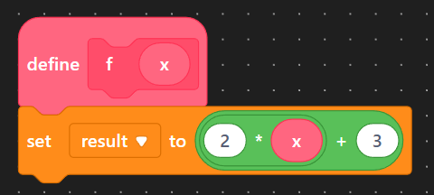

# About Functions

## What are Functions

A _function_ (sometimes called a method or procedure) is a block of code with a name.  When you use a function (referred to as _calling_ the function, or _invoking_ the function), all the code within that function is executed.  It is similar to the concept of functions from your mathematics classes.

| Mathematical Representation                                                                      | Sample Blocks                                                                                                             |
| ------------------------------------------------------------------------------------------------ | ------------------------------------------------------------------------------------------------------------------------- |
| <p><strong>Function Definition</strong><br><span class="math">f(x) = 2x+3</span></p>             | <p><strong>Function Definition</strong><br></p>     |
| <p><strong>Calling the Function</strong><br><span class="math">f(5)=2\cdot 5 + 3 = 13</span></p> | <p><strong>Calling the Method</strong><br></p> |

## Why use Functions

We can use function to bundle together code statements that are performing largely the same task.  This makes it easier to read your code, debug your code (when properly done), and organize your code into groups that make intuitive sense.

## How to Create Functions

Recall that to create variables, we needed to give the data type of the variable, and the variable name (and optionally, the value of the variable).  The general pattern was this

```
dataType variableName = value;
```

For functions, the pattern is similar.  We start with "the data type of the function", followed by the function name, a parameter list (which can be empty), and then the function body.  The general pattern is shown below.


The "data type of the function" is known as the "return type", and the function body is the code that the function runs when it is called.


```cpp
// Function with no parameters
returnType funcName()
{
    functionBody
}

// Function with parameters
returnType funcName(parameterType parameterName, ...)
{
    functionBody
}
```

You have already worked with some functions already.  Both `setup` and `loop` are functions whose return type is `void`.  The `digitalWrite` and `pinMode` functions are also `void`, and the `digitalRead` function has a return type of `bool`.  For now, we will create functions with a return type of `void`, before we look at non-void functions.
