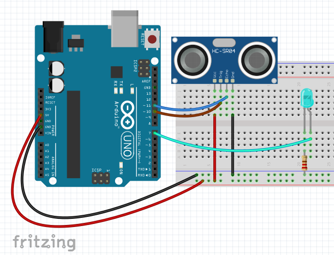
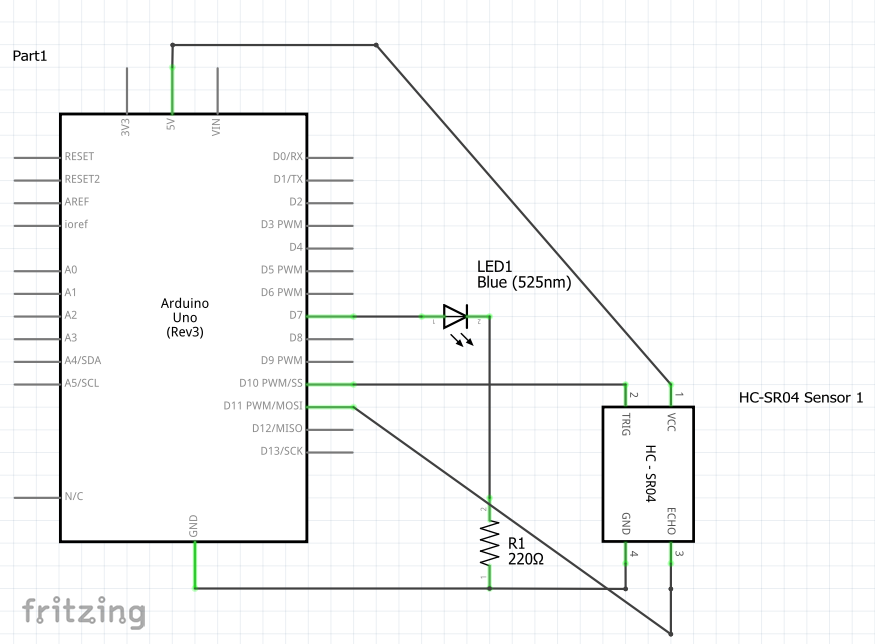

# Function Return Types

## Return Types

With the previous functions we all worked with, they were all `void` functions.  A function's return type tells us the data type of the data that the function outputs back to us.  If the return type is `void`, then it means the function will not return any data to us; if it is `int` for example, then the function returns an `int` which we can use in later lines of code.  Take the simple example below, which takes in a number, and returns its square.

```cpp
int square(int input)
{
    return input * input;
}

void loop()
{
    int time = 5;
    
    // The function returns 5 * 5 = 25, which is
    // stored in the variable longTime
    int longTime = square(time);
    
    // The program then waits for 25 milliseconds
    delay(longTime);
}
```

You have worked with non-void functions that have returns types before.  The `digitalRead` function can be thought of as a function that returns a `bool`.  The function returns either `true` or `false`.


Technically, `digitalRead` returns a data type of type `PinStatus`, which has values of `HIGH` or `LOW`, but understanding custom data types (i.e., enumerated types) are beyond the scope of this documentation at the moment.


```cpp
// The function returns the state of pin 8, which is stored in the variable
bool buttonState = digitalRead(8);

// Using the output of the function and checking if it is equal to HIGH
if (digitalRead(8) == HIGH) { ... }

// Using the output of the function directly in the condition
if (digitalRead(8)) { ... }
```

Another example is the built-in Arduino function named `map`.  The `map` function takes in a whole number, and maps it from one range to another range.  For example, mapping the value 0.5 from the range 0-1 to 0-100 would result in the value 50.  The `map` function has the following function signature:

```cpp
long map(long value, long fromLow, long fromHigh, long toLow, long toHigh)
```

The first `long` on the very left is the return type of the function (a `long` is essentially an `int`; it represents large whole numbers).  The next word, `map`, is the name of the function.  Within the parentheses, is the parameter list.  We see that the function takes in five parameters, all of which are longs.  Looking at the documentation, we see the following:

* `value`: the value to be mapped
* `fromLow`: the lower bound of the value's current range
* `fromHigh` : the upper bound of the value's current range
* `toLow` : the lower bound of the target range
* `toHigh`: the upper bound of the target range

For example, `map(0.5, 0, 1, 0, 100)` returns the value 50 (since 0.5 is mapped from the range 0 to 1, to 0 to 100).

## Reading Function Signatures

Being able to read function signatures will be useful when working with much of the hardware and sensors used in both Arduino and robotics.  See some examples below.

| Function Signature                      | Explanation                                                                                                                                               |
| --------------------------------------- | --------------------------------------------------------------------------------------------------------------------------------------------------------- |
| `double quadForm(int a, int b, int c)`  | A function named `quadForm` that returns a value of type `double`.  It takes in three parameters, all of which are whole numbers.                         |
| `bool isAlpha(char input)`              | A function named `isAlpha` that returns a value of type `bool`.  It takes in a single parameter that should be a `char` (a character).                    |
| `void pinMode(int pin, PinState state)` | A function named `pinMode` that does not return any data.  It takes in two parameters, an `int` and a `PinState` (which is `HIGH` and `LOW` for Arduino). |

## Ultrasonic Sensor Activity

### Circuit

Create a circuit that uses an ultrasonic distance sensor.  The sensor used in the diagram is an HC-SR04 distance sensor.  It has four pins

* VCC - should be connected to 5V power supply
* GND - should be connected to ground
* TRIG - the trigger pin; should be connected to any digital pin (the numbered pins)
* ECHO - the echo pin; should be connected to any digital pin (the numbered pins)

The way the sensor works is like echolocation.  The trigger pin sends out a pulse (an ultrasonic wave).  The pulse will bounce off of things and return to the echo pin.  We can use the speed of sound and the time it took to send and receive the pulse to calculate the distance things are from the sensor.

<figure><figcaption></figcaption></figure>

<figure><figcaption></figcaption></figure>

### Code

We begin our program by creating variables to store some key data.  We also set up the trigger pin to be an output pin, and the echo pin to be an input pin.

```cpp
#include <Arduino.h>    // only needed if programming in mBlock

int trigPin = 10;
int echoPin = 11;
int led = 7;

void setup()
{
    pinMode(led, OUTPUT);
    pinMode(trigPin, OUTPUT);
    pinMode(echopin, INPUT);
}
```

We then create a function that will measure and return the distance that objects are from our distance sensor.  We will do so by telling the trigger pin to send out a signal, reading the signal with the echo pin, and then using the following formula to convert the pulse travel time into distance.

$$
\text{distance} = \text{speed}\times \text{time}
$$

```cpp
double distanceCM()
{
    digitalWrite(trigPin, LOW);    // turn off any signals being emitted
    delayMicroseconds(2);          // brief delay before emitting next signal
    digitalWrite(trigPin, HIGH);   // emit signal for 10 microseconds
    delayMicroseconds(10);
    digitalWrite(triPin, LOW);
    
    // measure how long it took for the pulse to bounce back and get detected
    // duration is returned in microseconds
    double duration = pulseIn(echoPin, HIGH);
    
    double cmPerMicroSecond = 0.0343;
    
    // divide the distance by 2 since the wave has travelled to and from
    // the object we are trying to measure
    double distance = duration * cmPerMicroSecond / 2.0;
    
    return distance;    // remember to actually return the measured distance
}
```

Once we have this function, we can use it whenever we want when we want to find the distance an object is from our ultrasonic sensor.  We will write our program so that when we get close to our sensor, the LED will turn on.

```cpp
#include <Arduino.h>    // only needed if programming in mBlock

int trigPin = 10;
int echoPin = 11;
int led = 7;

void setup()
{
    pinMode(led, OUTPUT);
    pinMode(trigPin, OUTPUT);
    pinMode(echopin, INPUT);
}

void loop()
{
    double dist = distanceCM();    // measuring the distance and storing it in a variable
    if (dist < 10)    // if the distance measured is less than 10 cm
    {
        digitalWrite(led, HIGH);    // then turn on the LED
    }
    else
    {
        digitalWrite(led, LOW);    // otherwise, turn off the LED
    }
}

double distanceCM()
{ /* implementation given above */ }
```
