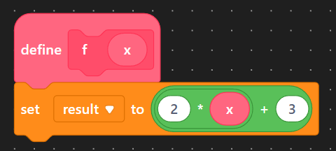

# Functions with Parameters

A parameter is an input to the function.  In the example below, the variable `x` is the parameter.


Note that when calling the function, when you give a specific value as input, that is called an **argument.**  In the examples below, the value `5` is the argument.  When we give arguments to functions, you will oftentimes referred to is as "passing in an argument" or "passing in a value".


| Mathematical Representation                                                                      | Sample Blocks                                                                                                             |
| ------------------------------------------------------------------------------------------------ | ------------------------------------------------------------------------------------------------------------------------- |
| <p><strong>Function Definition</strong><br><span class="math">f(x) = 2x+3</span></p>             | <p><strong>Function Definition</strong><br></p>     |
| <p><strong>Calling the Function</strong><br><span class="math">f(5)=2\cdot 5 + 3 = 13</span></p> | <p><strong>Calling the Method</strong><br></p> |

When declaring function parameters, you do so in the same way you declare regular variables: you must provide both the data type, and the name of the variable.

Note that function parameters can only be used _within_ the functions they are part of.  This is hopefully easier to see with blocks: the pink parameter `x` can be used within the function, but attempting to use the parameter in a different spot makes no sense.

<table><thead><tr><th>Code</th><th>Blocks</th></tr></thead><tbody><tr><td><pre class="language-cpp"><code class="lang-cpp">void loop()
{
    // waitTime is not defined
    // and cannot be used here
    delay(waitTime);
}

void someFunction(int waitTime)
{
    // perfectly fine to use it here
    delay(waitTime);
}
</code></pre></td><td><div><figure><figcaption></figcaption></figure></div></td></tr></tbody></table>

## Circuit

We will program three different buttons to blink an LED at different speeds, and will do so with a function that uses parameters.

<figure><figcaption></figcaption></figure>

<figure><figcaption></figcaption></figure>

## Program

We begin by creating variables for each of our components.

```cpp
#include <Arduino.h>    // only needed if programming in mBlock

int led = 7;
int button1 = 8;
int button2 = 9;
int button3 = 10;

void setup()
{
    pinMode(led, OUTPUT);
    pinMode(button1, INPUT);
    pinMode(button2, INPUT);
    pinMode(button3, INPUT);
}

void loop()
{

}
```

Then, we create a function that blinks an LED.  We will have a single parameter that represents the delay time between blinks.  This means that a smaller input number passed as argument, the faster the LED will blink.  Add this function underneath the `loop` function.

```cpp
void blinkLED(int duration)
{
    digitalWrite(led, HIGH);
    delay(duration);
    digitalWrite(led, LOW);
    delay(duration);
}
```

Now, we can call our function to have each button blink the LED a different speed.  By using a parameter, we can use the same function to blink the LED at different speeds simply by passing in different values.

```cpp
void loop()
{
    if (digialRead(button1))
    {
        blinkLED(1000);    // blinks every second
    }
    else if (digitalRead(button2))
    {
        blinkLED(500);    // blinks every half of a second
    }
    else if (digitalRead(button3))
    {
        blinkLED(100);    // blinks every 100 ms
    }
    else
    {
        digitalWrite(led, LOW);    // turn off the LED
    }
}
```

## Extension

Create a project that meets the following criteria:

* Has two LEDs
* Each LED should have two buttons that control them (so, four buttons total)
* Blink the LEDs at different speeds when each of their buttons are pressed
* Create a SINGLE function that allows you to blink any LED you want, and for any duration


If you want a function to take in more than one parameter, simply include them within the parentheses of the function definition.  For example, you could write something such as

```cpp
void setBrightness(int pin, int brightness)
```

and call it in your program by doing

```cpp
setBrightness(13, 100);
```

to set the brightness of an LED in pin 13 to a value of 100 (this is a made up example).

