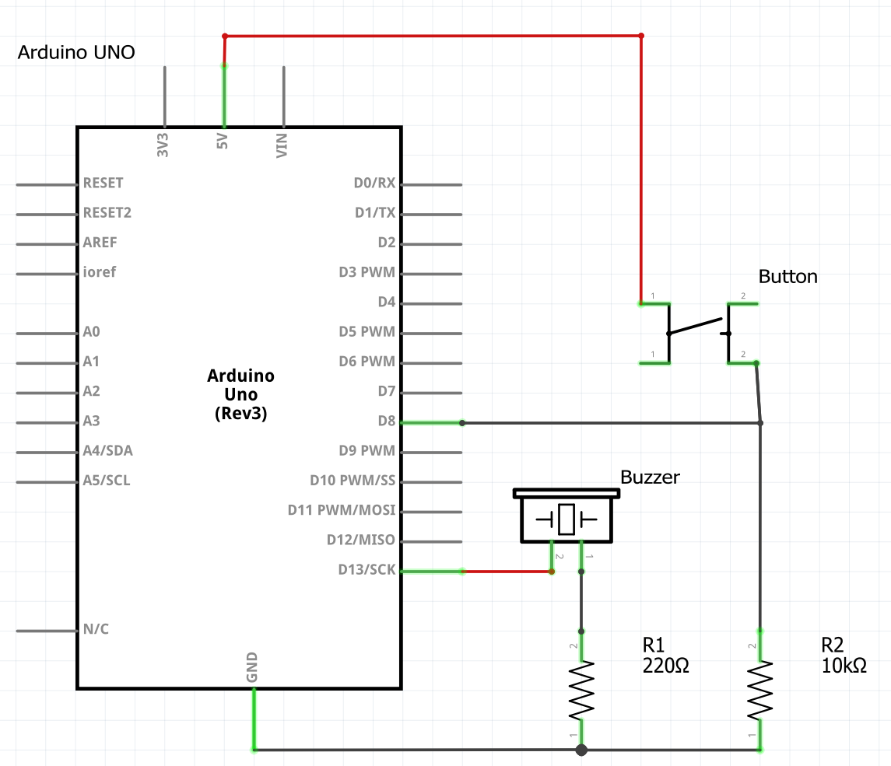

# Functions without Parameters

## Getting Started

We will create a program that plays the song "Mary Had a Little Lamb".  You can see the notes for it below.

<div align="left"><figure><figcaption></figcaption></figure></div>

## Circuit

Our program will play the song through a buzzer when a button is pressed.  Below is a sample circuit diagram as well as a schematic.


We suggest using a resistor with your buzzer so that you do not accidentally blow it out (damage it) when using it.  A 220 ohm resistor should be good enough.  Stronger resistors will cause the buzzer to be softer.  You can also switch your power line to 3.3V instead of 5V to get a softer sound as well.


<figure><figcaption></figcaption></figure>

<figure><figcaption></figcaption></figure>

## Program

Before we get into using functions, here is a snippet of what the program _could potentially_ look like if we did not use functions.

```cpp
#include <Arduino.h>    // only needed if programming on mBlock

// creating variables for the notes measured in Hz
int NOTE_C = 262;
int NOTE_D = 294;
int NOTE_E = 330;
int NOTE_G = 392;

// variables to keep track of beat and tempo
int DURATION = 250;
int BEAT = 300;
int REST = 800;

int buzzer = 13;
int button = 8;

void setup()
{
    pinMode(buzzer, OUTPUT);
    pinMode(button, INPUT);
}

void loop()
{
    if (digitalRead(button))
    {
        // mary had a little lamb
        tone(buzzer, NOTE_E4, DURATION);
        delay(BEAT);
        tone(buzzer, NOTE_D4, DURATION);
        delay(BEAT);
        tone(buzzer, NOTE_C4, DURATION);
        delay(BEAT);
        tone(buzzer, NOTE_D4, DURATION);
        delay(BEAT);
        tone(buzzer, NOTE_E4, DURATION);
        delay(BEAT);
        tone(buzzer, NOTE_E4, DURATION);
        delay(BEAT);
        tone(buzzer, NOTE_E4, DURATION);
        delay(REST);
        
        // little lamb, little lamb
        tone(buzzer, NOTE_D4, DURATION);
        delay(BEAT);
        tone(buzzer, NOTE_D4, DURATION);
        delay(BEAT);
        tone(buzzer, NOTE_D4, DURATION);
        delay(BEAT);
        tone(buzzer, NOTE_E4, DURATION);
        delay(BEAT);
        tone(buzzer, NOTE_G4, DURATION);
        delay(BEAT);
        tone(buzzer, NOTE_G4, DURATION);
        delay(REST);
        
        // more code below for the rest of the song...
    }
}      
```

Already, we can see that the program is going to get very, very long, and we have not even finished the first verse (the song actually has multiple verses: "everywhere that Mary went...", "it followed her to school one day...", "it made the children laugh and play...").  It is also difficult to tell what the program is doing when the button is pressed.  We know that it is playing some tones, but nothing beyond that.

Here is what the program could look like if we start grouping parts of the verses into functions.

<pre class="language-cpp"><code class="lang-cpp">#include &#x3C;Arduino.h>    // only needed if programming on mBlock

// creating variables for the notes measured in Hz
int NOTE_C = 262;
int NOTE_D = 294;
int NOTE_E = 330;
int NOTE_G = 392;

// variables to keep track of beat and tempo
int DURATION = 250;
int BEAT = 300;
int REST = 800;

int buzzer = 13;
int button = 8;

void setup()
{
  pinMode(buzzer, OUTPUT);
  pinMode(button, INPUT);
}

void loop()
{
  if (digitalRead(button))
  {
    maryHad();
    littleLamb();
    maryHad();
    whiteAsSnow();
  }
}

/* mary had a little lamb */
void maryHad()
{
  tone(buzzer, NOTE_E4, DURATION);
  delay(BEAT);
  tone(buzzer, NOTE_D4, DURATION);
  delay(BEAT);
  tone(buzzer, NOTE_C4, DURATION);
  delay(BEAT);
  tone(buzzer, NOTE_D4, DURATION);
  delay(BEAT);
  tone(buzzer, NOTE_E4, DURATION);
  delay(BEAT);
  tone(buzzer, NOTE_E4, DURATION);
  delay(BEAT);
  tone(buzzer, NOTE_E4, DURATION);
  delay(REST);
}

/* little lamb, little lamb */
<strong>void littleLamb()
</strong>{
  tone(buzzer, NOTE_D4, DURATION);
  delay(BEAT);
  tone(buzzer, NOTE_D4, DURATION);
  delay(BEAT);
  tone(buzzer, NOTE_D4, DURATION);
  delay(BEAT);
  tone(buzzer, NOTE_E4, DURATION);
  delay(BEAT);
  tone(buzzer, NOTE_G4, DURATION);
  delay(BEAT);
  tone(buzzer, NOTE_G4, DURATION);
  delay(REST);
}

/* whose fleece was white as snow */
void whiteAsSnow()
{
  tone(buzzer, NOTE_E4, DURATION);
  delay(BEAT);
  tone(buzzer, NOTE_D4, DURATION);
  delay(BEAT);
  tone(buzzer, NOTE_D4, DURATION);
  delay(BEAT);
  tone(buzzer, NOTE_E4, DURATION);
  delay(BEAT);
  tone(buzzer, NOTE_D4, DURATION);
  delay(BEAT);
  tone(buzzer, NOTE_C4, DURATION);
  delay(REST);
}
</code></pre>

We can go one step further, and put all the functions within _another_ function to simplify our code even further.

<pre class="language-cpp"><code class="lang-cpp">#include &#x3C;Arduino.h>    // only needed if programming on mBlock

<strong>// created variables not shown
</strong>
void setup()
{
  pinMode(buzzer, OUTPUT);
  pinMode(button, INPUT);
}

void loop()
{
  if (digitalRead(button))  // if the button is pressed
  {
    playVerse();            // then play the verse
  }
}


void playVerse()
{
  maryHad();
  littleLamb();
  maryHad();
  whiteAsSnow();
}

/* mary had a little lamb */
void maryHad()
{ /* implementation not shown */ }

/* little lamb, little lamb */
void littleLamb()
{ /* implementation not shown */ }

/* whose fleece was white as snow */
void whiteAsSnow()
{ /* implementation not shown */ }
</code></pre>

Notice that at the very end, after we grouped our code into functions, the code within `loop` (which is the main code that is running in our Arduino program) was simply

```cpp
void loop()
{
    // if we press the button, then play the verse
    if (digitalRead(button))
    {
        playVerse();
    }
}
```

This is not only much shorter, but it is also easier to read and figure out what the program is doing (in a general sense).
