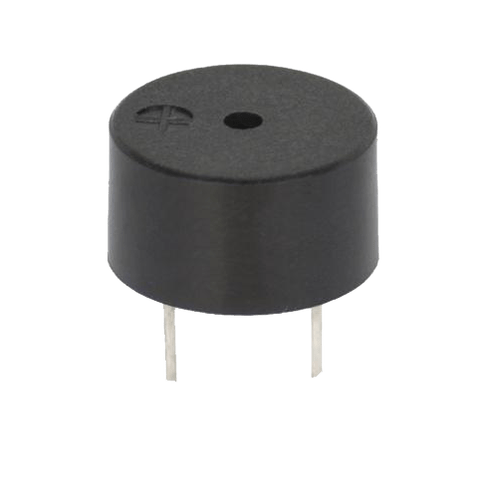

# Piezo Buzzers (Optional Content)

To help us explore and motivate the usage of functions, we will be using a Piezo buzzer to play sounds (notes, and music).


Some buzzers are **polarized**, which means that it does matter which leg receives voltage, and which leg is connected to electrical ground.  Some buzzers are labeled (the positive leg will have a plus (+) sign on it), while other buzzers have legs with different lengths.  Like LEDs, the longer leg is the positive leg, and the shorter leg is the negative leg (and goes to electrical ground).  Unlabeled buzzers with equal length legs are probably nonpolarized.


<figure><figcaption>
A polarized Piezo buzzer
</figcaption></figure>

To have Piezo buzzers play sounds, we use the `tone` function from the Arduino standard library.  Find the official documentation below.



Below is a table of notes and the approximate frequencies that produce them.  Table generated using ChatGPT.

<table><thead><tr><th width="160">Note</th><th data-type="number">Frequency (Hz)</th></tr></thead><tbody><tr><td>C4</td><td>262</td></tr><tr><td>C#4 / Db4</td><td>277</td></tr><tr><td>D4</td><td>294</td></tr><tr><td>D#4 / Eb4</td><td>310</td></tr><tr><td>E4</td><td>330</td></tr><tr><td>F4</td><td>349</td></tr><tr><td>F#4 / Gb4</td><td>370</td></tr><tr><td>G4</td><td>392</td></tr><tr><td>G#4 / Ab4</td><td>415</td></tr><tr><td>A4</td><td>440</td></tr><tr><td>A#4 / Bb4</td><td>466</td></tr><tr><td>B4</td><td>494</td></tr></tbody></table>
