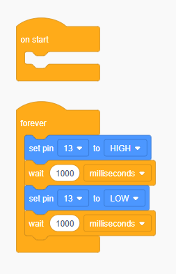

# First Circuit - Blinking an LED

## The Circuit

In our first program, we will simply turn LEDs on and off.  An LED is a **L**ight **E**mitting **D**iode, and gives off light when current (electricity) runs through it in the correct direction.  Build the following circuit below.  You can build using either physical components, or virtually through TinkerCAD.

1. Grab the necessary components.  You will need
   * Jumper wires (at least 2)
   * x1 Resistor (at least 220 Ohms)
   * x1 LED
   * x1 breadboard
2. Using a jumper wire, make a connection between pin 13 and the breadboard.
3. Connect one leg of your resistor to pin 13 (using the connection you just made on the breadboard in Step 2).
4. Connect the other leg of your resistor to the long leg of your LED.
5. Using a jumper wire, jump the long leg of your LED to a ground (GND) pin on your Arduino



## LED Blink Program

Our program will cause our LED to turn on and off (blink) at 1 second intervals.  The code logic is like this:

* Turn the LED on
* Wait for 1 second (the LED stays on for the duration of the wait time)
* Turn the LED off
* Wait 1 second (the LED stays off for the duration of the wait time)
* Code loops back to the top and repeats this forever

### Setup Code

We want to configure the pin our LED is connected to as an `OUTPUT` pin, so that the pin can send voltage that turns the LED on and off.  Do so by setting the pin mode of our pin to `OUTPUT` in `setup` .


The example below has us using pin 13, but if you have wired your LED to a different pin, then make sure you put _your_ pin number in your code.


```arduino
void setup()
{
    pinMode(13, OUTPUT);
}
```

### Loop Code

We use `digitalWrite`  to make our pin send `HIGH` or `LOW` signals, and allow the LED to stay on or off by using a `delay` .



<div align="left"><figure><figcaption><p>Arduino Blink Code</p></figcaption></figure></div>



```arduino
void setup()
{
  pinMode(13, OUTPUT);
}

void loop()
{
  digitalWrite(13, HIGH);
  delay(1000);
  digitalWrite(13, LOW);
  delay(1000);
}
```



Send the code by clicking on the "Start Simulation" button (if on TinkerCAD) or by clicking on the arrow button on the top left hand corner of the Arduino IDE.  Make sure you have plugged in your Arduino and selected the correct board in the dropdown menu at the top of the Arduino IDE.

## Extension

Wire up more LEDs, and get them to blink in various configurations.  Some things you can try:

* Get all LEDs to blink at the same time
* Get the LEDs to blink one at a time, one after the other
* Get the LEDs to turn on one at a time, and then all turn off after the last LED has turned on
