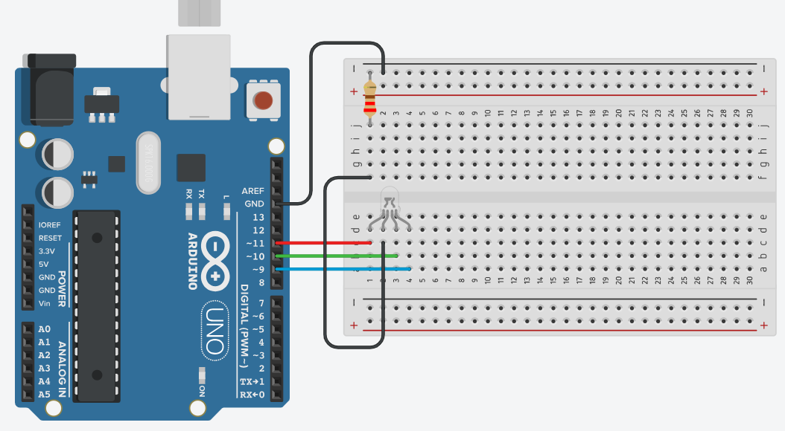

# Classes

## RGB Circuit

Recreate the circuit below, or [simulate the circuit online here](https://www.tinkercad.com/things/5UBOKWcLkd3-rgb-led-structs).

<figure><figcaption><p>RGB LED Wired to an Arduino</p></figcaption></figure>


Not all RGB LEDs are made equal.  Make sure you have the correct wiring diagram for your specific RGB LED so that you have the order of the legs correct.  The schematic below assumes that we are working with an RCGB pin layout (where the C leg is C for "common"; i.e., the leg that is connected to ground (GND)).


## Class as an Extension of Structs

If you are coming from C or C++, a class can be thought of a struct that also has methods.  For example, if you had a struct which represented an RGB LED, instead of making a method that sets the color the LED as external to the struct and passing the RGB LED as a parameter, you could instead make the method "part of the struct" and use the parameter from the RGB LED itself.



```cpp
struct RGBLed {
    // code not shown
};

// Note that the RGBLed is given to the method as parameter
void setColor(RGBLed led, double r, double g, double b) {
    // code not shown
}

RGBLed rgbLED = /* value not shown */;

void loop() {
    setColor(rgbLED, 255, 0, 0);    // the LED is red
}
```



```cpp
class RGBLed {
    // other code not shown
    
    // setColor is part of the class
    void setColor(double r, double g, double b) {
        // code not shown
    }
};

RGBLed rgbLED = /* value not shown */;

void loop() {
    // We do not need to give the RGBLed to the method as parameter
    // since we are setting the color of this particular RGBLed
    rgbLED.setColor(255, 0, 0);    // the LED is red
}
```



## What is a Class

A class is a collection (bundle, or group) of code that defines a data type in much the same way that `int`, `double`, or `String`, define integer, decimal, and textual data types respectively.  A variable whose data type is a class data type is called an _object_ of the class, or _an instance of_ the class.  For example, if we had a class named `RGBLed`  that we used to represent RGB LEDs in our program code, then - in the same way that `int x` defines a variable named `x` of type `int` - the code `RGBLed myLed` defines a variable named `myLed` that is an _object_ of the `RGBLed` class (i.e., `myLed` is an instance of the `RGBLed` class.

The added advantage of a class is that a class data type can have multiple pieces of data within it, and can also have associated methods that can be used to access or modify the values of the data within the class.

## Making a Class - RGBLed

### Attributes

We will create a class to represent RGB LEDs in our program code.  An RGB LED has three (3) programmable components that we care about: a pin number for the red leg, a pin number for the green leg, and a pin number for the blue leg.  We will create our class to bundle together these three pieces of data as `int` variables.  These are called the _class attributes_ (sometimes called _fields_, or _instance variables_).

C++ (as well as other programming languages such as Java) also allows you to control whether or not the user (or other programmers) have access to the attributes of the class.  Since we do not want (or need) the user to directly interface with the pin numbers of the RGB LED, we will make these attributes private for now.

```arduino
class RGBLed {
  private:
    int r;
    int g;
    int b;
};
```

### Creating Class Type Variables

How do I create variables of class data types?  We do it in the same way we make any other variable.  For our `RGBLed` class, we make a variable of that type like so.

```arduino
class RGBLed {
  private:
    int r;
    int g;
    int b;
};

RGBLed rgbLED;

void setup() {}
void loop() {}
```

***

Now how do we assign our variable a value?  How would we even _create_ such a value?

```arduino
int x = 5;    // I can create and assign numbers to x
String word = "hello";    // I can create and assign text to word
RGBLed rgbLED = /* but what on earth goes here? */;
```

For other data types, the answers to these types of questions are easy.  For an `int` variable, I assign it whole numbers, and I create whole numbers by literally just typing the number (e.g., `int x = 5`).  For `String` type variables, the values are any form of text enclosed by double-quotation marks, and I can create `String` values by typing things within said double-quotation marks (e.g., `String word = "hello"`).

What value do we assign a variable of type `RGBLed`?  The answer, is an `RGBLed` object (in other words, an instance of the `RGBLed` class).  That is _what_ we assign the variable, but _how_ exactly do we _create_ an object?

```arduino
RGBLed rgbLED = /* RGBLed object goes here */;
```

### Constructors

We create objects (instances) of a class by calling the class constructor.  The class constructor is a special kind of method with the following properties:

* The name of the constructor (which is a method) is the name of the class
* The constructor has no return type (not even void; you leave the return type blank)
* In addition to whatever the body of the constructor does, it will also create and return an object of the class to you

Typically, constructors will set up or assign initial values to the attributes of the objects that it is creating.  We will create a constructor for our `RGBLed` class that takes in three `int` values as parameters, and assigns them to the `r`, `g`, and `b` pins of the object.  Note that since we want other users and programmers to have access to the class constructor, we make it publicly accessible.

See a visualization of the code using the link below.


Using constructors in this way is very similar to the way we defined and used the `createRGB` method for our `RGBLed` struct.




```arduino
class RGBLed {
  public:
    // This is the constructor; note the lack of return type
    RGBLed(int rPin, int gPin, int bPin) {
      r = rPin;
      g = gPin;
      b = bPin;
    }

  private:
    int r;
    int g;
    int b;
};

/** Constructing an RGBLed object whose RGB pins are wired to
* Arduino pins 11, 10, and 9 respectively.  This object is
* assigned to the RGBLed variable named rgb1.
*/
RGBLed rgb1 = RGBLed(11, 10, 9);  // calling (invoking) the constructor here
RGBLed rgb2;

void setup() {
  rgb2 = RGBLed(6, 5, 3);  // you can call the constructor in setup as well
}
void loop() {}
```



```arduino
struct RGBLed {
    int r;
    int g;
    int b;
};

void createRGB(RGBLed &led, int rPin, int gPin, int bPin) {
    led.r = rPin;
    led.g = gPin;
    led.b = bPin;
}

RGBLed rgb1;
RGBLed rgb2;

void setup() {
    createRGB(rgb1, 11, 10, 9);
    createRGB(rgb2, 6, 5, 3);
}
void loop() {}
```



{% embed url="https://pythontutor.com/render.html#code=class%20RGBLed%20%7B%0A%20%20public%3A%0A%20%20%20%20//%20This%20is%20the%20constructor%0A%20%20%20%20RGBLed%28int%20rPin,%20int%20gPin,%20int%20bPin%29%20%7B%0A%20%20%20%20%20%20r%20%3D%20rPin%3B%0A%20%20%20%20%20%20g%20%3D%20gPin%3B%0A%20%20%20%20%20%20b%20%3D%20bPin%3B%0A%20%20%20%20%7D%0A%0A%20%20private%3A%0A%20%20%20%20int%20r%3B%0A%20%20%20%20int%20g%3B%0A%20%20%20%20int%20b%3B%0A%7D%3B%0A%0Aint%20main%28%29%20%7B%0A%20%20RGBLed%20rgb1%20%3D%20RGBLed%2811,%2012,%2013%29%3B%0A%20%20RGBLed%20rgb2%20%3D%20RGBLed%288,%209,%2010%29%3B%0A%20%20return%200%3B%0A%7D&cumulative=false&curInstr=15&heapPrimitives=nevernest&mode=display&origin=opt-frontend.js&py=cpp_g%2B%2B9.3.0&rawInputLstJSON=%5B%5D&textReferences=false" fullWidth="false" %}
C++ Visualization of RGBLed Constructors


### Class Methods

Making class methods is the exact same as making any other kind of method.  The only difference is that you access these methods from an object specific to that class, and by using the dot (`.`) operator.


In order for methods (or attributes) to be accessed from an object with the dot operator, they must have public access.


We will create two methods: one that initializes the pins of the RGB LED, and one that sets the color of the RGB LED (similar to how we did when using structs).



```arduino
class RGBLed {
  public:
    // This is the constructor; note the lack of return type
    RGBLed(int rPin, int gPin, int bPin) {
      r = rPin;
      g = gPin;
      b = bPin;
    }
    
    // init method; note the return type
    void init() {
      pinMode(r, OUTPUT);
      pinMode(g, OUTPUT);
      pinMode(b, OUTPUT);
    }
    
    // setColor method; note the return type
    void setColor(int rVal, int gVal, int bVal) {
      analogWrite(r, rVal);
      analogWrite(g, gVal);
      analogWrite(b, bVal);
    }

  private:
    int r;
    int g;
    int b;
};

RGBLed rgb1 = RGBLed(11, 10, 9);  // calling (invoking) the constructor here
RGBLed rgb2 = RGBLed(6, 5, 3);

void setup() {
    // Setting up the pin modes for each RGB LED
    rgb1.init();
    rgb2.init();
}
void loop() {
    rgb1.setColor(42, 76, 46);
    rgb2.setColor(19, 85, 21);
}
```



```arduino
struct RGBLed {
    int r;
    int g;
    int b;
};

void createRGB(RGBLed &led, int rPin, int gPin, int bPin) {
    led.r = rPin;
    led.g = gPin;
    led.b = bPin;
}

void initRGB(RGBLed led) {
    pinMode(led.r, OUTPUT);
    pinMode(led.g, OUTPUT);
    pinMode(led.b, OUTPUT);
}

void setColorRGB(RGBLed led, int rVal, int gVal, int bVal) {
    analogWrite(led.r, rVal);
    analogWrite(led.g, gVal);
    analogWrite(led.b, bVal);
}

RGBLed rgb1;
RGBLed rgb2;
RGBLed rgb3;

void setup() {
    createRGB(rgb1, 11, 10, 9);
    createRGB(rgb2, 6, 5, 3);
    
    // Setting up the pin modes for each RGB LED
    initRGB(rgb1);
    initRGB(rgb2);
}
void loop() {
    rgb1.setColorRGB(rgb1, 42, 76, 46);
    rgb2.setColorRGB(rgb2, 19, 85, 21);
}
```


