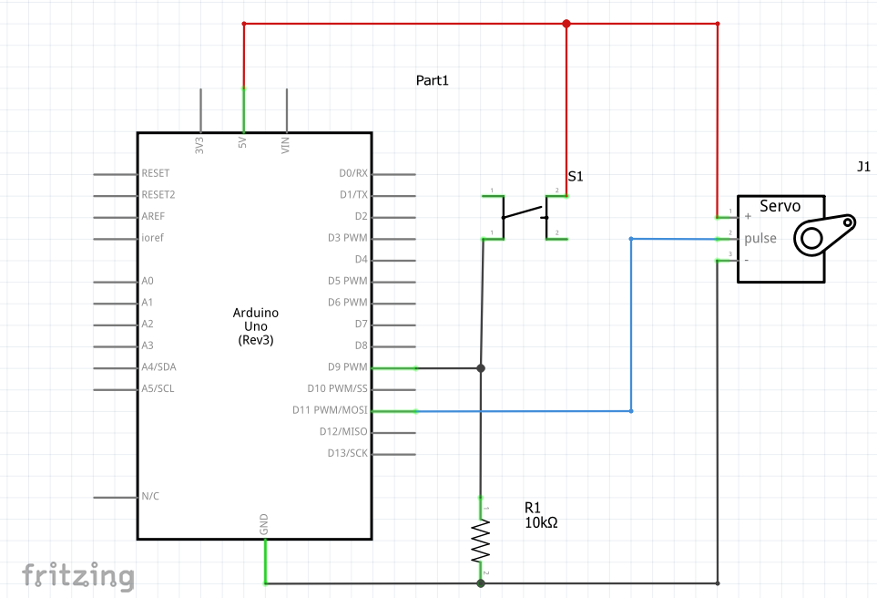

# Using Objects and Classes

An important concept in (object oriented) programming is encapsulation.  This is where we bundle code into abstractions called "classes".  A class is a bundle of both data and functions into a single entity.  Classes will typically represent something either in real life or something that is complicated in general.

We begin our study of classes and objects with the `Servo` class.  The `Servo` class represents servos, which are small motors.  We will design a circuit and write a program so that a servo will spin when a button is pressed.

## Circuit

Servos have three wires:

* Power - Usually red in color.  This wire should be connected to a power supply between 3-5V.
* Ground - Usually black in color.  This wire should be connected to electrical ground.
* Signal - The last wire (can be brown, orange, white, yellow, among other colors).  Voltage sent through this wire will have the servo rotate to a different position depending on the strength of the signal.

Create a similar circuit below.


What is shown below is actually NOT the suggested way to wire up servos.  A servo is able to draw much more current than the Arduino can provide.  This occurs if the servo is trying to move against a heavy load (or if something is blocking it from rotating).  It is much better to wire it with a separate power supply (such as AA batteries in series, or a 9V with a resistor) as well as with a capacitor.  See a sample at [Arduino - Servo Motors](https://docs.arduino.cc/learn/electronics/servo-motors/).\
\
If the servo will be freely rotating (like in the project we are about to do), then powering the servo with the Arduino is fine.  Just take care not to hold onto the servo arm while it is rotating.


<figure><figcaption></figcaption></figure>

<figure><figcaption></figcaption></figure>

## Code

### Creating Objects

Our first goal is to create code that will represent our servo.  A servo is much different from the other electrical components we have been working with.  All the other hardware (buzzers, distance sensor, button, LED) are programmable simply by programming the _pins_ that they are attached to on the Arduino.  A servo is much more complicated than simply using digital reads and writes.

The way we get around this is to use the `Servo` class.  The `Servo` class is code that someone wrote to represent and properly interface with a servo when using Arduino.  We create a `Servo` object like so.

```cpp
Servo servo1 = Servo();
```

Note that creating a `Servo` object is exactly the same (in principle) to creating variables of any other data type.  Recall that the general pattern is

```
dataType variableName = value;
```

As such, we can match the first `Servo` as the data type.  The name of our variable is `servo1`.  This means that the value of the variable is `Servo()`.  This last function is special, and is called the **class constructor.**  Class constructors have these special properties:

* The name of the function is the name of the class (in this case, `Servo`)
* They create (or construct) objects of your class, which you can use to assign to variables

In the future, when we program with motors and other sensors, we will be using classes that represent each thing (e.g., a motor class, a distance sensor class, a button class).

The general pattern for creating objects is shown below.  Remember that the class name and class constructor are the same.

```cpp
ClassName objectName = Constructor();

// Some examples with made up classes
// Constructors might also take parameters, but that is not shown here
Button btn = Button();
LED light = LED();
Motor left_motor = Motor();
```

### The Program

We begin by importing the `Servo` class into our program.  At the top of your program, include the following line of code.

```cpp
#include <Arduino.h>    // only needed if programming on mBlock
#include <Servo.h>      // importing the Servo class
```


If programming with Arduino IDE, then you'll also need to import the library into the IDE itself before using it in your program.  Search for the Servo library when following the instructions here at [Arduino | Installing Libraries](https://docs.arduino.cc/software/ide-v1/tutorials/installing-libraries/).


We then proceed to make a variable for our button, as well as a `Servo` object.

```cpp
#include <Arduino.h>    // only needed if programming on mBlock
#include <Servo.h>      // importing the Servo class

int button = 9;
Servo servo1 = Servo();    // constructing a Servo object
```

We now use the various functions that come bundled with the `Servo` class to interface with the `Servo` object we have created.  We will use the `attach` and `write` functions to tell the program what pin our `Servo` is connected to, as well as to tell it how far to rotate.  To use functions from a particular object, you type the name of the object, followed by a dot (period), and then the function you wish to use.


Full Servo documentation can be found here \[[LINK](https://docs.arduino.cc/libraries/servo/)].  Note that in general, when trying to do things with classes and objects, you simply look up the documentation for that class, and see if there is a function in that class that does what you want it to do.\
\
For example, many classes for motors will typically have a function named `set` (or similar) that sets the speed or power of the motor.  They might also have `invert` to flip the direction the motor spins, and `stop` to fully stop the motor.


```cpp
#include <Arduino.h>    // only needed if programming on mBlock
#include <Servo.h>      // importing the Servo class

int button = 9;
Servo servo1 = Servo();    // constructing a Servo object

void setup()
{
    pinMode(button, INPUT);
    servo1.attach(11);    // attaching the servo to pin 11
}

void loop()
{
    if (digitalRead(button))
    {
        servo1.write(180);    // servo moves to 180 degrees
    }
    else
    {
        servo1.write(90);    // servo moves to 90 degrees
    }
}
```

## Extension

Create a circuit that has both a servo and an ultrasonic distance sensor.  Create a program that has the servo act like a dial.  When an object is placed close to the sensor, the servo should rotate towards 0 degrees.  When the object is farther away, the servo will rotate towards 180 degrees.

A few things to consider:

* The minimum and maximum values a servo can rotate to are 0 and 180 degrees
* You might need to experimentally measure the minimum and maximum values detected by the sensor
  * In TinkerCAD, you can simulate the sensor by clicking the Start Simulation button, and then clicking on the sensor itself.  It detects about 3 cm minimum, and 330 cm maximum.
* Use the `map` function to correctly map the minimum and maximum distance detection values to the servo rotation values
