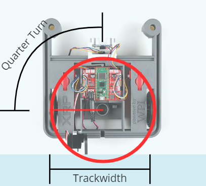

# Extension 3 - Turning

## Extension 3 - Turning

One way to turn the robot at a right angle (left or right turn) is to make the motors run until the robot has traced out one-fourth of a circle (a quarter-turn).  Modify your autonomous routine so that the robot makes (near) perfect left and right turns.  The image below shows _one way_ to think about the problem (how to turn in place).  There is more than one way to solve the problem, and more than one way to turn (e.g., turning in place, or turning on a pivot).

<figure><figcaption>
Circle traced out when turning in place
</figcaption></figure>
